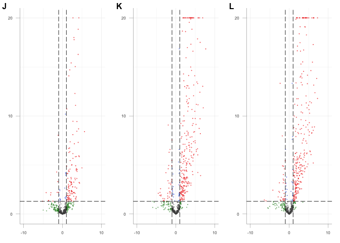

Marston et al 2021
================
Luis P Iniguez
11/22/2021

# Marston et al. 2021

``` r
library(ensembldb) #
```

    ## Loading required package: BiocGenerics

    ## Loading required package: parallel

    ## 
    ## Attaching package: 'BiocGenerics'

    ## The following objects are masked from 'package:parallel':
    ## 
    ##     clusterApply, clusterApplyLB, clusterCall, clusterEvalQ,
    ##     clusterExport, clusterMap, parApply, parCapply, parLapply,
    ##     parLapplyLB, parRapply, parSapply, parSapplyLB

    ## The following objects are masked from 'package:stats':
    ## 
    ##     IQR, mad, sd, var, xtabs

    ## The following objects are masked from 'package:base':
    ## 
    ##     anyDuplicated, append, as.data.frame, basename, cbind, colnames,
    ##     dirname, do.call, duplicated, eval, evalq, Filter, Find, get, grep,
    ##     grepl, intersect, is.unsorted, lapply, Map, mapply, match, mget,
    ##     order, paste, pmax, pmax.int, pmin, pmin.int, Position, rank,
    ##     rbind, Reduce, rownames, sapply, setdiff, sort, table, tapply,
    ##     union, unique, unsplit, which.max, which.min

    ## Loading required package: GenomicRanges

    ## Loading required package: stats4

    ## Loading required package: S4Vectors

    ## 
    ## Attaching package: 'S4Vectors'

    ## The following objects are masked from 'package:base':
    ## 
    ##     expand.grid, I, unname

    ## Loading required package: IRanges

    ## Loading required package: GenomeInfoDb

    ## Loading required package: GenomicFeatures

    ## Loading required package: AnnotationDbi

    ## Loading required package: Biobase

    ## Welcome to Bioconductor
    ## 
    ##     Vignettes contain introductory material; view with
    ##     'browseVignettes()'. To cite Bioconductor, see
    ##     'citation("Biobase")', and for packages 'citation("pkgname")'.

    ## Loading required package: AnnotationFilter

    ## 
    ## Attaching package: 'ensembldb'

    ## The following object is masked from 'package:stats':
    ## 
    ##     filter

``` r
library(matrixStats) #
```

    ## 
    ## Attaching package: 'matrixStats'

    ## The following objects are masked from 'package:Biobase':
    ## 
    ##     anyMissing, rowMedians

``` r
library(ggplot2) #
library(cowplot)#
library(DESeq2)
```

    ## Loading required package: SummarizedExperiment

    ## Loading required package: MatrixGenerics

    ## 
    ## Attaching package: 'MatrixGenerics'

    ## The following objects are masked from 'package:matrixStats':
    ## 
    ##     colAlls, colAnyNAs, colAnys, colAvgsPerRowSet, colCollapse,
    ##     colCounts, colCummaxs, colCummins, colCumprods, colCumsums,
    ##     colDiffs, colIQRDiffs, colIQRs, colLogSumExps, colMadDiffs,
    ##     colMads, colMaxs, colMeans2, colMedians, colMins, colOrderStats,
    ##     colProds, colQuantiles, colRanges, colRanks, colSdDiffs, colSds,
    ##     colSums2, colTabulates, colVarDiffs, colVars, colWeightedMads,
    ##     colWeightedMeans, colWeightedMedians, colWeightedSds,
    ##     colWeightedVars, rowAlls, rowAnyNAs, rowAnys, rowAvgsPerColSet,
    ##     rowCollapse, rowCounts, rowCummaxs, rowCummins, rowCumprods,
    ##     rowCumsums, rowDiffs, rowIQRDiffs, rowIQRs, rowLogSumExps,
    ##     rowMadDiffs, rowMads, rowMaxs, rowMeans2, rowMedians, rowMins,
    ##     rowOrderStats, rowProds, rowQuantiles, rowRanges, rowRanks,
    ##     rowSdDiffs, rowSds, rowSums2, rowTabulates, rowVarDiffs, rowVars,
    ##     rowWeightedMads, rowWeightedMeans, rowWeightedMedians,
    ##     rowWeightedSds, rowWeightedVars

    ## The following object is masked from 'package:Biobase':
    ## 
    ##     rowMedians

``` r
library(EnhancedVolcano)
```

    ## Loading required package: ggrepel

    ## Registered S3 methods overwritten by 'ggalt':
    ##   method                  from   
    ##   grid.draw.absoluteGrob  ggplot2
    ##   grobHeight.absoluteGrob ggplot2
    ##   grobWidth.absoluteGrob  ggplot2
    ##   grobX.absoluteGrob      ggplot2
    ##   grobY.absoluteGrob      ggplot2

``` r
library(pheatmap)
library(kableExtra)
library(ggsci) #
library(purrr)
```

    ## 
    ## Attaching package: 'purrr'

    ## The following object is masked from 'package:GenomicRanges':
    ## 
    ##     reduce

    ## The following object is masked from 'package:IRanges':
    ## 
    ##     reduce

``` r
library(GenomicRanges)
library(wesanderson)
library(viridis)
```

    ## Loading required package: viridisLite

``` r
library(UpSetR)
library(dplyr)
```

    ## 
    ## Attaching package: 'dplyr'

    ## The following object is masked from 'package:kableExtra':
    ## 
    ##     group_rows

    ## The following object is masked from 'package:matrixStats':
    ## 
    ##     count

    ## The following objects are masked from 'package:ensembldb':
    ## 
    ##     filter, select

    ## The following object is masked from 'package:AnnotationDbi':
    ## 
    ##     select

    ## The following object is masked from 'package:Biobase':
    ## 
    ##     combine

    ## The following objects are masked from 'package:GenomicRanges':
    ## 
    ##     intersect, setdiff, union

    ## The following object is masked from 'package:GenomeInfoDb':
    ## 
    ##     intersect

    ## The following objects are masked from 'package:IRanges':
    ## 
    ##     collapse, desc, intersect, setdiff, slice, union

    ## The following objects are masked from 'package:S4Vectors':
    ## 
    ##     first, intersect, rename, setdiff, setequal, union

    ## The following objects are masked from 'package:BiocGenerics':
    ## 
    ##     combine, intersect, setdiff, union

    ## The following objects are masked from 'package:stats':
    ## 
    ##     filter, lag

    ## The following objects are masked from 'package:base':
    ## 
    ##     intersect, setdiff, setequal, union

``` r
library(clusterProfiler)
```

    ## 

    ## clusterProfiler v4.0.5  For help: https://yulab-smu.top/biomedical-knowledge-mining-book/
    ## 
    ## If you use clusterProfiler in published research, please cite:
    ## T Wu, E Hu, S Xu, M Chen, P Guo, Z Dai, T Feng, L Zhou, W Tang, L Zhan, X Fu, S Liu, X Bo, and G Yu. clusterProfiler 4.0: A universal enrichment tool for interpreting omics data. The Innovation. 2021, 2(3):100141. doi: 10.1016/j.xinn.2021.100141

    ## 
    ## Attaching package: 'clusterProfiler'

    ## The following object is masked from 'package:purrr':
    ## 
    ##     simplify

    ## The following objects are masked from 'package:ensembldb':
    ## 
    ##     filter, select

    ## The following object is masked from 'package:AnnotationDbi':
    ## 
    ##     select

    ## The following object is masked from 'package:IRanges':
    ## 
    ##     slice

    ## The following object is masked from 'package:S4Vectors':
    ## 
    ##     rename

    ## The following object is masked from 'package:stats':
    ## 
    ##     filter

``` r
library(enrichplot)
library(writexl)
library(gridExtra)
```

    ## 
    ## Attaching package: 'gridExtra'

    ## The following object is masked from 'package:dplyr':
    ## 
    ##     combine

    ## The following object is masked from 'package:Biobase':
    ## 
    ##     combine

    ## The following object is masked from 'package:BiocGenerics':
    ## 
    ##     combine

``` r
library(VennDiagram)
```

    ## Loading required package: grid

    ## Loading required package: futile.logger

``` r
library(stringr)
library(ropls)
library(biosigner)
library(C50)
library(biomaRt)
library(writexl)
library(farver)
library(PCAtools)
```

    ## 
    ## Attaching package: 'PCAtools'

    ## The following objects are masked from 'package:stats':
    ## 
    ##     biplot, screeplot

``` r
library(magrittr)
```

    ## 
    ## Attaching package: 'magrittr'

    ## The following object is masked from 'package:purrr':
    ## 
    ##     set_names

    ## The following object is masked from 'package:AnnotationFilter':
    ## 
    ##     not

``` r
library(edgeR)
```

    ## Loading required package: limma

    ## 
    ## Attaching package: 'limma'

    ## The following object is masked from 'package:DESeq2':
    ## 
    ##     plotMA

    ## The following object is masked from 'package:BiocGenerics':
    ## 
    ##     plotMA

``` r
library(DelayedMatrixStats)
```

    ## Loading required package: DelayedArray

    ## Loading required package: Matrix

    ## 
    ## Attaching package: 'Matrix'

    ## The following object is masked from 'package:S4Vectors':
    ## 
    ##     expand

    ## 
    ## Attaching package: 'DelayedArray'

    ## The following object is masked from 'package:clusterProfiler':
    ## 
    ##     simplify

    ## The following object is masked from 'package:purrr':
    ## 
    ##     simplify

    ## The following objects are masked from 'package:base':
    ## 
    ##     aperm, apply, rowsum, scale, sweep

    ## 
    ## Attaching package: 'DelayedMatrixStats'

    ## The following objects are masked from 'package:matrixStats':
    ## 
    ##     colAnyMissings, rowAnyMissings

``` r
library(pals)
```

    ## 
    ## Attaching package: 'pals'

    ## The following objects are masked from 'package:viridis':
    ## 
    ##     cividis, inferno, magma, plasma, turbo, viridis

    ## The following objects are masked from 'package:viridisLite':
    ## 
    ##     cividis, inferno, magma, plasma, turbo, viridis

``` r
library(ComplexHeatmap)
```

    ## ========================================
    ## ComplexHeatmap version 2.8.0
    ## Bioconductor page: http://bioconductor.org/packages/ComplexHeatmap/
    ## Github page: https://github.com/jokergoo/ComplexHeatmap
    ## Documentation: http://jokergoo.github.io/ComplexHeatmap-reference
    ## 
    ## If you use it in published research, please cite:
    ## Gu, Z. Complex heatmaps reveal patterns and correlations in multidimensional 
    ##   genomic data. Bioinformatics 2016.
    ## 
    ## The new InteractiveComplexHeatmap package can directly export static 
    ## complex heatmaps into an interactive Shiny app with zero effort. Have a try!
    ## 
    ## This message can be suppressed by:
    ##   suppressPackageStartupMessages(library(ComplexHeatmap))
    ## ========================================
    ## ! pheatmap() has been masked by ComplexHeatmap::pheatmap(). Most of the arguments
    ##    in the original pheatmap() are identically supported in the new function. You 
    ##    can still use the original function by explicitly calling pheatmap::pheatmap().

    ## 
    ## Attaching package: 'ComplexHeatmap'

    ## The following object is masked from 'package:pheatmap':
    ## 
    ##     pheatmap

``` r
library(tidyr)
```

    ## 
    ## Attaching package: 'tidyr'

    ## The following objects are masked from 'package:Matrix':
    ## 
    ##     expand, pack, unpack

    ## The following object is masked from 'package:magrittr':
    ## 
    ##     extract

    ## The following object is masked from 'package:S4Vectors':
    ## 
    ##     expand

``` r
library(devtools)
```

    ## Loading required package: usethis

``` r
library(ReMapEnrich) 
```

    ## Loading required package: data.table

    ## 
    ## Attaching package: 'data.table'

    ## The following objects are masked from 'package:dplyr':
    ## 
    ##     between, first, last

    ## The following object is masked from 'package:purrr':
    ## 
    ##     transpose

    ## The following object is masked from 'package:SummarizedExperiment':
    ## 
    ##     shift

    ## The following object is masked from 'package:GenomicRanges':
    ## 
    ##     shift

    ## The following object is masked from 'package:IRanges':
    ## 
    ##     shift

    ## The following objects are masked from 'package:S4Vectors':
    ## 
    ##     first, second

    ## Loading required package: R.utils

    ## Loading required package: R.oo

    ## Loading required package: R.methodsS3

    ## R.methodsS3 v1.8.1 (2020-08-26 16:20:06 UTC) successfully loaded. See ?R.methodsS3 for help.

    ## R.oo v1.24.0 (2020-08-26 16:11:58 UTC) successfully loaded. See ?R.oo for help.

    ## 
    ## Attaching package: 'R.oo'

    ## The following object is masked from 'package:R.methodsS3':
    ## 
    ##     throw

    ## The following objects are masked from 'package:devtools':
    ## 
    ##     check, unload

    ## The following object is masked from 'package:magrittr':
    ## 
    ##     equals

    ## The following object is masked from 'package:SummarizedExperiment':
    ## 
    ##     trim

    ## The following object is masked from 'package:GenomicRanges':
    ## 
    ##     trim

    ## The following object is masked from 'package:IRanges':
    ## 
    ##     trim

    ## The following objects are masked from 'package:methods':
    ## 
    ##     getClasses, getMethods

    ## The following objects are masked from 'package:base':
    ## 
    ##     attach, detach, load, save

    ## R.utils v2.11.0 (2021-09-26 08:30:02 UTC) successfully loaded. See ?R.utils for help.

    ## 
    ## Attaching package: 'R.utils'

    ## The following object is masked from 'package:tidyr':
    ## 
    ##     extract

    ## The following object is masked from 'package:ComplexHeatmap':
    ## 
    ##     draw

    ## The following object is masked from 'package:magrittr':
    ## 
    ##     extract

    ## The following object is masked from 'package:utils':
    ## 
    ##     timestamp

    ## The following objects are masked from 'package:base':
    ## 
    ##     cat, commandArgs, getOption, inherits, isOpen, nullfile, parse,
    ##     warnings

    ## Loading required package: RMySQL

    ## Loading required package: DBI

    ## 
    ## Attaching package: 'ReMapEnrich'

    ## The following object is masked from 'package:dplyr':
    ## 
    ##     intersect

    ## The following object is masked from 'package:GenomicRanges':
    ## 
    ##     intersect

    ## The following object is masked from 'package:GenomeInfoDb':
    ## 
    ##     intersect

    ## The following object is masked from 'package:IRanges':
    ## 
    ##     intersect

    ## The following object is masked from 'package:S4Vectors':
    ## 
    ##     intersect

    ## The following object is masked from 'package:BiocGenerics':
    ## 
    ##     intersect

    ## The following object is masked from 'package:base':
    ## 
    ##     intersect

``` r
ajust_res<-function(mat,pval=20,log2=5){
  temp<-mat[!is.na(mat$padj),]
  temp[-log10(temp$padj)>pval,"padj"]<-10^-pval
  temp[temp$log2FoldChange>log2,"log2FoldChange"]<-log2
  temp[temp$log2FoldChange< -log2,"log2FoldChange"]<- -log2
  return(temp)
}

plotPCA_LPI<-function(x,titel="PCA",features=300,coldata,color="Mutant",shape=NA, PC=c(1,2)){
  vs<-rowVars(x)
  idx<-order(vs, decreasing = TRUE)[seq_len(min(features,length(vs)))]
  PCA_LPI <- prcomp(t(x[idx,]))
  percentVar<-round(100*summary(PCA_LPI)$importance[2,PC],0)
  color_LPI<-coldata[colnames(x),color]
  if(!is.na(shape)){shape_LPI=coldata[colnames(x),shape]}else{shape_LPI="A"}
  plotingPCA<-data.frame(PC1=PCA_LPI$x[,PC[1]],
                         PC2=PCA_LPI$x[,PC[2]],
                         Color=color_LPI,
                         Shape=shape_LPI)
  plot<-ggplot(data=plotingPCA)+
    geom_point(aes(x=PC1,y=PC2,colour=Color, shape=Shape),size=3.5)+
    labs(colour=color,shape=shape)+ 
    xlab(paste0("PC", PC[1],": ",percentVar[1],"% variance"))+
    ylab(paste0("PC", PC[2],": ",percentVar[2],"% variance"))+
    ggtitle(titel)+
    theme_cowplot(12)+
    theme(text = element_text(size=15))
  if(!is.na(shape)){return(plot)}else{return(plot+guides(shape="none"))}
}

plotSingleGeneric<-function(gofi=NULL,id=NULL, ddsobj, geneName=F, vstobj=NULL, groups="Infection",bf=NULL,pf=NULL, anno=NULL){
  if(!xor(is.null(gofi),is.null(id))){stop("GOFI or ID must have a value")}
  if(is.null(gofi)){gofi<-ifelse(geneName,SummarizedExperiment::rowData(ddsobj)[id,"Gene_name"],id)}
  if(is.null(id) & is.null(anno)){stop("For using gofi you need to provide an annotation file throug anno")}
  if(is.null(id)){id=rownames(subset(anno,Gene_name==gofi))}
  if(!length(id)==1){stop("GOFI or ID not present in data or not unique")}
  if (!all(groups %in% names(colData(ddsobj)))){stop("all variables in 'intgroup' must be columns of colData")}
  if(is.null(vstobj)){
    vals<-counts(ddsobj,normalized=T)[id,]
    ylab<-"Normalized Expression"
  }else{
    vals<-assay(vstobj)[id,]
    ylab<-"Log2 Normalized Expression"
  }
  facto <- if (length(groups) == 1) {colData(ddsobj)[[groups]]
          }else if (length(groups) == 2) {
             lvls <- as.vector(t(outer(levels(colData(ddsobj)[[groups[1]]]), 
                              levels(colData(ddsobj)[[groups[2]]]), function(x, y) paste(x, y, sep = ":"))))
             droplevels(factor(apply(as.data.frame(colData(ddsobj)[,groups,drop = FALSE]),
                                     1, paste, collapse = ":"), 
                      levels = lvls))
            }else {
              factor(apply(as.data.frame(colData(ddsobj)[, groups, drop = FALSE]), 
                 1, paste, collapse = ":"))
              }
  bf2p<-if(!is.null(bf)){colData(ddsobj)[[bf]]}else{"NA"}
  pf2p<-if(!is.null(pf)){colData(ddsobj)[[pf]]}else{"NA"}
  paplot <- data.frame(count = vals, group = facto,bf=bf2p,pf=pf2p)
  p<-ggplot(paplot, aes(x=facto,y=count, group=facto))+
    geom_boxplot(aes(fill=bf),outlier.shape = NA)+
    geom_point(alpha=0.75,position=position_jitter(w=0.2,h=0),size=3,aes(color=pf))+
    ylab(ylab)+
    ggtitle(gofi)+
    labs(fill = "none",color="none")+
    theme_cowplot(12)+
    theme(axis.title.x = element_blank())
  if(is.null(bf)){p<- p+scale_fill_manual(values = "white")+guides(fill="none")}
  if(is.null(pf)){p<- p+scale_color_manual(values = "black")+guides(color="none")
  }else{p<- p+scale_color_viridis_d(option = "E")}
  return(p)
}

panelExpression<-function(id){
  
  calu3<-plotSingleGeneric(id= id, ddsobj = dds_inf_groups, pf = "Study")+theme(legend.position = "bottom")+
    ggtitle("Calu3")
  A549<-plotSingleGeneric(id= id, ddsobj = dds_inf_groups_A549)+
    ggtitle("A549")+
    ylab("")
  cs<-plotSingleGeneric(id= id, ddsobj = dds_inf_groups_BALF,groups = "Group")+
    ggtitle("Clinical Samples")+
    scale_x_discrete(labels=c("BALF Healthy","BALF COVID-19","PBMC Healthy","PBMC COVID-19"))+
    ylab("")
  return(plot_grid(calu3,A549,cs, nrow=1,align = "h",axis = "bt"))
}

panelExpression2<-function(id){
  
  calu3<-plotSingleGeneric(id= id, ddsobj = dds_inf_groups)+
    ggtitle("Calu3")
    
  A549<-plotSingleGeneric(id= id, ddsobj = dds_inf_groups_A549)+
    ggtitle("A549")+
    ylab("")
  return(plot_grid(calu3,A549, nrow=1,align = "h"))
}

herv_Fam_enrich<-function(herv_counts,herv_expr_counts,hervs_DE_counts){
  total<-sum(herv_counts[,1])
  total_DE<-sum(hervs_DE[,1])

  enriched_1<-data.frame(row.names=rownames(hervs_DE_counts),
                     pvalue=rep(1,length(rownames(hervs_DE_counts))),
                     FDR=rep(1,length(rownames(hervs_DE_counts))))
  for(i in rownames(hervs_DE)){
      not_f<-total_DE-hervs_DE[i,]
      not_f_t<-herv_counts[i,1]-hervs_DE[i,]
      not_not_f<-total-not_f-not_f_t-hervs_DE[i,]
      enriched_1[i,"pvalue"]<-fisher.test(matrix(c(hervs_DE[i,],not_f,not_f_t,not_not_f),
                                                 ncol=2,byrow = F),alternative = "g")$p.value
  }
  enriched_1$FDR<-p.adjust(enriched_1[,1],method = "fdr")
  enric<-rownames(subset(enriched_1,FDR< 0.05))
  out_1a<-data.frame(Family=enric,
              Group=as.character(herv_counts_db[enric,"Group"]),
              "Differentially Expressed"=hervs_DE[enric,"Freq"],
              "Expressed in Dataset" = herv_expr_counts[enric,"Freq"],
              "In Genome" = herv_counts_db[enric,"Count"],
              "pvalue"=enriched_1[enric,1],
              "FDR"=as.numeric(enriched_1[enric,2]))
  out_1a<-out_1a[order(out_1a$FDR),]
  return(out_1a)
}
```

## Read Files

``` r
#Load samples metadata
samples_CoV2 <- read.table("data/Samples_Covid19_Calu3_4Jez.txt", sep = "\t", header = TRUE)
samples_CoV2$Group <- paste0(substr(samples_CoV2$SampleName, 1, nchar(samples_CoV2$SampleName)-1))
samples_MS <- read.table("data/Samples_MERSSARS_Calu3_4Jez.txt", sep = "\t", header = TRUE)
samples_MS$Group <- paste0(samples_MS$SampleName)

samples_CMS <- rbind(samples_CoV2[,c(1,2,7)], samples_MS[,c(2,4,11)])
samples_CMS_mod<-samples_CMS
samples_CMS_mod$Infection <- factor(c("Mock","Mock","Mock","SARS-CoV-2",
                                      "SARS-CoV-2","SARS-CoV-2","Mock","Mock",
                                      "SARS","SARS","Mock","Mock"
                                      ,"MERS","MERS"),
                                    levels=c("Mock","SARS-CoV-2","SARS","MERS"))
samples_CMS_mod$Study<- factor(c(rep("Blanco-Melo et al.",6),rep("Yeung et al.",8)),
                                 levels=c("Blanco-Melo et al.","Yeung et al."))
#Load gene count matrices
geneCounts_CoV2 <- read.table("data/Gene_Counts_Covid19_Calu3_4Jez.txt", header=TRUE)
geneCounts_MS <- read.table("data/Gene_Counts_MERSSARS_Calu3_4Jez.txt", header=TRUE)
geneCounts_CMS <-  merge(geneCounts_CoV2, geneCounts_MS, by="row.names",all=TRUE)
rownames(geneCounts_CMS)<-geneCounts_CMS$Row.names
geneCounts_CMS<-geneCounts_CMS[,-1]
geneCounts_CMS[is.na(geneCounts_CMS)]<-0

#Load retro count matrices
retroCounts_CoV2 <- read.table("data/Retro_Counts_Covid19_Calu3_4Jez.txt", header=TRUE)
retroCounts_MS <- read.table("data/Retro_Counts_MERSSARS_Calu3_4Jez.txt", header=TRUE)
retroCounts_CMS <- merge(retroCounts_CoV2, retroCounts_MS, by="row.names",all=TRUE)
rownames(retroCounts_CMS)<-retroCounts_CMS$Row.names
retroCounts_CMS<-retroCounts_CMS[,-1]
retroCounts_CMS[is.na(retroCounts_CMS)]<-0
```

``` r
samples_A549 <- read.table("data/samples_A549_EDIT.txt", sep = "\t", header = TRUE)

samples_A549_mod<-samples_A549
samples_A549_mod$Infection <- factor(c("Mock","Mock","IAV","IAV",
                                      "Mock","Mock","Mock", 
                                      "SARS-CoV-2","SARS-CoV-2","SARS-CoV-2",
                                      "Mock","Mock","Mock",
                                      "RSV","RSV","RSV",
                                      "HPIV3","HPIV3","HPIV3"),
                                    levels=c("Mock","SARS-CoV-2","IAV","RSV","HPIV3"))
samples_A549_mod$Experiment<- factor(c(rep("IAV",4),rep("SARS-CoV-2",6),rep("RSV",6), rep("HPIV3",3)),
                                 levels=c("IAV","SARS-CoV-2","RSV","HPIV3"))
row.names(samples_A549_mod) <- samples_A549_mod$SampleName

#Load gene count matrices
geneCounts_A549 <- read.csv("data/Salmon_Gene_table_A549.csv", header=TRUE)
row.names(geneCounts_A549) <- geneCounts_A549[,1]
geneCounts_A549 <- geneCounts_A549[-1]

#Load retro count matrices
retroCounts_A549 <- read.csv("data/HERV_L1_table_A549.csv", header=TRUE)
row.names(retroCounts_A549) <- retroCounts_A549[,1]
retroCounts_A549 <- retroCounts_A549[-1]
```

``` r
samples_A549_ACE2 <- read.table("data/samples_A549_ACE2_FINAL.txt", sep = "\t", header = TRUE)

samples_A549_ACE2_mod<-samples_A549_ACE2
samples_A549_ACE2_mod$Infection <- factor(c("Mock","Mock","Mock",
                                        "SARS-CoV-2_02","SARS-CoV-2_02","SARS-CoV-2_02",
                                        "Mock","Mock","Mock",
                                      "SARS-CoV-2_2","SARS-CoV-2_2","SARS-CoV-2_2",
                                      "SARS-CoV-2_Treat","SARS-CoV-2_Treat","SARS-CoV-2_Treat"),
                                    levels=c("Mock","SARS-CoV-2_02","SARS-CoV-2_2","SARS-CoV-2_Treat"))
samples_A549_ACE2_mod$Batch <- factor(c("1","1","1",
                                        "1","1","1",
                                        "2","2","2",
                                      "2","2","2",
                                      "2","2","2"),
                                    levels=c("1","2"))
row.names(samples_A549_ACE2_mod) <- samples_A549_ACE2_mod$SampleName
#samples_A549_mod$Experiment<- factor(c(rep("IAV",4),rep("SARS-CoV-2",6)),
#                                 levels=c("IAV","SARS-CoV-2"))

#Load gene count matrices
geneCounts_A549_ACE2_B1 <- read.csv("data/Salmon_Gene_table_A549_ACE2_B1.csv", header=TRUE)
row.names(geneCounts_A549_ACE2_B1) <- geneCounts_A549_ACE2_B1[,1]
geneCounts_A549_ACE2_B1 <- geneCounts_A549_ACE2_B1[-1]

geneCounts_A549_ACE2_B2 <- read.csv("data/Salmon_Gene_table_oeACE2.csv", header=TRUE)

geneCounts_A549_ACE2 <- merge(geneCounts_A549_ACE2_B1, geneCounts_A549_ACE2_B2, by="row.names",all=TRUE)
row.names(geneCounts_A549_ACE2) <- geneCounts_A549_ACE2[,1]
geneCounts_A549_ACE2 <- geneCounts_A549_ACE2[-1]
geneCounts_A549_ACE2[is.na(geneCounts_A549_ACE2)]<-0
names(geneCounts_A549_ACE2) <- rownames(samples_A549_ACE2_mod)

#Load retro count matrices
retroCounts_A549_ACE2_B1 <- read.csv("data/HERV_L1_table_A549_ACE2_B1.csv", header=TRUE)
row.names(retroCounts_A549_ACE2_B1) <- retroCounts_A549_ACE2_B1[,1]
retroCounts_A549_ACE2_B1 <- retroCounts_A549_ACE2_B1[-1]

retroCounts_A549_ACE2_B2 <- read.csv("data/HERV_L1_table_oeACE2.csv", header=TRUE)
#row.names(retroCounts_A549_ACE2_B2) <- retroCounts_A549_ACE2_B2[,1]
#retroCounts_A549_ACE2_B2 <- retroCounts_A549_ACE2_B2[-1]

retroCounts_A549_ACE2 <- merge(retroCounts_A549_ACE2_B1, retroCounts_A549_ACE2_B2, by="row.names",all=TRUE)
row.names(retroCounts_A549_ACE2) <- retroCounts_A549_ACE2[,1]
retroCounts_A549_ACE2 <- retroCounts_A549_ACE2[-1]
retroCounts_A549_ACE2[is.na(retroCounts_A549_ACE2)]<-0
names(retroCounts_A549_ACE2) <- rownames(samples_A549_ACE2_mod)
```

``` r
#Load sample matrices
samples_BALF <- read.table("data/BALF_samples.txt", sep = "\t", header = TRUE)
samples_BALF$Group <- paste0(samples_BALF$What,"_",samples_BALF$Infection)
samples_BALF <- samples_BALF[c(1:3, 5, 7:13), c(3, 6, 13)]
row.names(samples_BALF) <- samples_BALF$SampleName
samples_BALF <- samples_BALF[, c(2:3)]

samples_BALF_mod<-samples_BALF
samples_BALF_mod$Sample<-c("PBMC","PBMC","BALF","BALF","PBMC","PBMC","PBMC","PBMC","BALF","BALF","BALF")
#Load gene count matrices
geneCounts_BALF <- read.csv("data/Salmon_Gene_table_BALF.csv", header=TRUE)

#Load retro count matrices
retroCounts_BALF <- read.csv("data/HERV_L1_table_BALF.csv", header=TRUE)
```

## Load Annotations

``` r
build_ens_DB<-function(){
  system("curl -q ftp://ftp.ensembl.org/pub/release-99/gtf/homo_sapiens/Homo_sapiens.GRCh38.99.gtf.gz --output Homo_sapiens.GRCh38.99.gtf.gz")
  DB<-ensembldb::ensDbFromGtf("Homo_sapiens.GRCh38.99.gtf.gz")
}
build_te_DB<-function(){
  system("curl -q https://raw.githubusercontent.com/LIniguez/Telescope_MetaAnnotations/main/TE_annotation.v2.0.tsv --output TE_annotation.v2.0.tsv")
}

ifelse(!file.exists("Homo_sapiens.GRCh38.99.sqlite"),
       yes=build_ens_DB(), 
       no= "Annotations already downloaded")
```

    ## [1] "Annotations already downloaded"

``` r
hg38_ens99<- ensembldb::EnsDb("Homo_sapiens.GRCh38.99.sqlite")

ifelse(!file.exists("TE_annotation.v2.0.tsv"),
       yes=build_te_DB(), 
       no= "Retro Annotations already downloaded")
```

    ## [1] "Retro Annotations already downloaded"

``` r
hg38_retro<- read.delim("TE_annotation.v2.0.tsv")
rownames(hg38_retro)<-hg38_retro$Locus

retro<-hg38_retro[,c("Locus","Locus","Family","Class")]
rownames(retro)<-retro$Locus
colnames(retro) <- c("ID","Gene_id","Gene_name","Type")

genes<-sapply(strsplit(rownames(geneCounts_CoV2),split = ".",fixed=T),"[[",1)
genes_DF<-genes(hg38_ens99,columns=c("gene_id","gene_name","gene_biotype"),
      filter = GeneIdFilter(genes),
      return.type = "DataFrame")
colnames(genes_DF) <- c("ID","Gene_name","Type")
rownames(genes_DF) <-rownames(geneCounts_CoV2)

herv_counts_db<-read.table("https://github.com/LIniguez/Telescope_MetaAnnotations/raw/main/HERVs_family_counts.txt", col.names = c("Type","Count","Group"),row.names = 1)

LPI_annotation<-rbind(genes_DF,retro[,c(1,3,4)])
LPI_annotation$Type<-as.character(LPI_annotation$Type)
LPI_annotation$TypeShort<-"gene"
LPI_annotation[grepl(LPI_annotation$Type,pattern="HERV"),"TypeShort"]<-"HERV"
LPI_annotation[grepl(LPI_annotation$Type,pattern="L1"),"TypeShort"]<-"L1"
LPI_annotation[grepl(LPI_annotation$Type,pattern="lncRNA"),"TypeShort"]<-"lncRNA"
LPI_annotation[grepl(LPI_annotation$Type,pattern="pseudogene"),"TypeShort"]<-"Pseudogene"

retro_annotationMat <- read.table("TE_annotation.v2.0.tsv", header=TRUE)
rownames(retro_annotationMat) <- retro_annotationMat[,1]
```

## Filter Samples

``` r
mincount <- 10;
all_g_CMS_temp <- rbind(geneCounts_CMS,retroCounts_CMS)

expressed_g_CMS<- rowSums(all_g_CMS_temp[,grep(samples_CMS_mod$Infection,pattern="Mock",value = F)] >= mincount) >= 2 |
  rowSums(all_g_CMS_temp[,grep(samples_CMS_mod$Infection,pattern="SARS-CoV-2")] >= mincount) >= 2 |
  rowSums(all_g_CMS_temp[,grep(samples_CMS_mod$Infection,pattern="SARS")] >= mincount) >= 2 |
  rowSums(all_g_CMS_temp[,grep(samples_CMS_mod$Infection,pattern="MERS")] >= mincount) >= 2

all_g_CMS<- all_g_CMS_temp[expressed_g_CMS,]
```

``` r
all_g_A549<- rbind(geneCounts_A549, retroCounts_A549)

expressed_g_A549<- rowSums(all_g_A549[,grep(samples_A549_mod$Infection,patter="Mock")] >= mincount) >= 2 |
  rowSums(all_g_A549[,grep(samples_A549_mod$Infection,patter="SARS-CoV-2")] >= mincount) >= 2 |
  rowSums(all_g_A549[,grep(samples_A549_mod$Infection,patter="IAV")] >= mincount) >= 2 |
  rowSums(all_g_A549[,grep(samples_A549_mod$Infection,patter="RSV")] >= mincount) >= 2 |
  rowSums(all_g_A549[,grep(samples_A549_mod$Infection,patter="HPIV3")] >= mincount) >= 2 


all_g_A549<- all_g_A549[expressed_g_A549,]
```

``` r
all_g_A549_ACE2<- rbind(geneCounts_A549_ACE2, retroCounts_A549_ACE2)

expressed_g_A549_ACE2<- rowSums(all_g_A549_ACE2[,grep(samples_A549_ACE2_mod$Infection,patter="Mock")] >= mincount) >= 2 |
  rowSums(all_g_A549_ACE2[,grep(samples_A549_ACE2_mod$Infection,patter="SARS-CoV-2_02")] >= mincount) >= 2 |
  rowSums(all_g_A549_ACE2[,grep(samples_A549_ACE2_mod$Infection,patter="SARS-CoV-2_2")] >= mincount) >= 2 |
  rowSums(all_g_A549_ACE2[,grep(samples_A549_ACE2_mod$Infection,patter="SARS-CoV-2_Treat")] >= mincount) >= 2

all_g_A549_ACE2<- all_g_A549_ACE2[expressed_g_A549_ACE2,]
```

``` r
all_g_BALF<- rbind(geneCounts_BALF, retroCounts_BALF)

expressed_g_BALF<- rowSums(all_g_BALF[,grep(samples_BALF$Group,patter="BALF_Healthy")] >= mincount) >= 2 |
  rowSums(all_g_BALF[,grep(samples_BALF$Group,patter="BALF_SARS_CoV2")] >= mincount) >= 2 |
  rowSums(all_g_BALF[,grep(samples_BALF$Group,patter="PBMC_Healthy")] >= mincount) >= 2 |
  rowSums(all_g_BALF[,grep(samples_BALF$Group,patter="PBMC_SARS_CoV2")] >= mincount) >= 2


all_g_BALF<- all_g_BALF[expressed_g_BALF,]
```

## Define Features

``` r
#Calu3
genes_CMS<-grep(rownames(all_g_CMS),pattern="ENSG",value = T)
hervs_l1_CMS<-grep(rownames(all_g_CMS),pattern="ENSG",value = T,invert = T)
hervs_CMS<-grep(rownames(all_g_CMS),pattern="ENSG|L1FL|L1ORF|chr",value = T,invert = T)
l1_CMS<-grep(rownames(all_g_CMS),pattern="L1FL|L1ORF",value = T)

#A540
genes_A549<-grep(rownames(all_g_A549),pattern="ENSG",value = T)
hervs_l1_A549<-grep(rownames(all_g_A549),pattern="ENSG",value = T,invert = T)
hervs_A549<-grep(rownames(all_g_A549),pattern="ENSG|L1FL|L1ORF|chr",value = T,invert = T)
l1_A549<-grep(rownames(all_g_A549),pattern="L1FL|L1ORF",value = T)

#A549_ACE2
genes_A549_ACE2<-grep(rownames(all_g_A549_ACE2),pattern="ENSG",value = T)
hervs_A549_ACE2<-grep(rownames(all_g_A549_ACE2),pattern="ENSG|L1FL|L1ORF|chr",value = T,invert = T)
hervs_l1_A549_ACE2<-grep(rownames(all_g_A549_ACE2),pattern="ENSG",value = T,invert = T)
l1_A549_ACE2<-grep(rownames(all_g_A549_ACE2),pattern="L1FL|L1ORF",value = T)

#BALF + PBMC
genes_BALF<-grep(rownames(all_g_BALF),pattern="ENSG",value = T)
hervs_BALF<-grep(rownames(all_g_BALF),pattern="ENSG|L1FL|L1ORF|chr",value = T,invert = T)
hervw_BALF<-grep(rownames(all_g_BALF),pattern="HERVW_",value = T,invert = F)
l1_BALF<-grep(rownames(all_g_BALF),pattern="L1FL|L1ORF",value = T)
```

## Differential Expression Calu3

``` r
dds_inf_groups <- DESeqDataSetFromMatrix(countData = all_g_CMS,
                              colData = samples_CMS_mod,
                              design= ~ Infection+Study)
```

    ## converting counts to integer mode

    ##   Note: levels of factors in the design contain characters other than
    ##   letters, numbers, '_' and '.'. It is recommended (but not required) to use
    ##   only letters, numbers, and delimiters '_' or '.', as these are safe characters
    ##   for column names in R. [This is a message, not a warning or an error]

``` r
dds_inf_groups <- DESeq(dds_inf_groups)
```

    ## estimating size factors
    ##   Note: levels of factors in the design contain characters other than
    ##   letters, numbers, '_' and '.'. It is recommended (but not required) to use
    ##   only letters, numbers, and delimiters '_' or '.', as these are safe characters
    ##   for column names in R. [This is a message, not a warning or an error]

    ## estimating dispersions

    ## gene-wise dispersion estimates

    ## mean-dispersion relationship

    ##   Note: levels of factors in the design contain characters other than
    ##   letters, numbers, '_' and '.'. It is recommended (but not required) to use
    ##   only letters, numbers, and delimiters '_' or '.', as these are safe characters
    ##   for column names in R. [This is a message, not a warning or an error]

    ## final dispersion estimates

    ##   Note: levels of factors in the design contain characters other than
    ##   letters, numbers, '_' and '.'. It is recommended (but not required) to use
    ##   only letters, numbers, and delimiters '_' or '.', as these are safe characters
    ##   for column names in R. [This is a message, not a warning or an error]

    ## fitting model and testing

``` r
dds_inf_groups$Infection <- factor(dds_inf_groups$Infection, levels = c("Mock", "SARS-CoV-2", "SARS", "MERS"))
vsd_inf_groups <- vst(dds_inf_groups,blind = T)

res_SARSCOV2 <- results(dds_inf_groups,contrast = c("Infection", "SARS-CoV-2","Mock"), test = "Wald")
res_SARSCOV1 <- results(dds_inf_groups,contrast = c("Infection","SARS", "Mock"), test = "Wald")
res_MERS <- results(dds_inf_groups,contrast = c("Infection", "MERS", "Mock"), test = "Wald")

# write.table(res_SARSCOV2, file = "res_SARSCOV2_Calu3.txt", quote=FALSE, sep="\t")
# write.table(res_SARSCOV1, file = "res_SARSCOV1_Calu3.txt", quote=FALSE, sep="\t")
# write.table(res_MERS, file = "res_MERS_Calu3.txt", quote=FALSE, sep="\t")

subset(res_SARSCOV2[hervs_CMS,],padj<0.05 & abs(log2FoldChange)>1) %>% rownames() %>% hg38_retro[.,c("Chrom","Start","End","Strand")] %>% write.table("HERVs_DE_calu3_SARS_COV2.txt",quote=F,sep="\t")

TE_DE_list_sars2<-subset(res_SARSCOV2[c(hervs_CMS,l1_CMS),],padj<0.05 & abs(log2FoldChange)>1) %>% rownames()
```

``` r
retro_de_up_COV2<-grep(rownames(res_SARSCOV2[which(res_SARSCOV2$padj<0.05 & res_SARSCOV2$log2FoldChange>=1),]),pattern="ENSG", invert = T, value = T)

retro_de_up_SARS<-grep(rownames(res_SARSCOV1[which(res_SARSCOV1$padj<0.05 & res_SARSCOV1$log2FoldChange>=1),]),pattern="ENSG", invert = T, value = T)

retro_de_up_MERS<-grep(rownames(res_MERS[which(res_MERS$padj<0.05 & res_MERS$log2FoldChange>=1),]),pattern="ENSG", invert = T, value = T)

int_retro_Calu3_up <- base::intersect(retro_de_up_COV2, retro_de_up_SARS) %>% base::intersect(retro_de_up_MERS)
```

### Volcano plots of DE HERVs

``` r
theme_voc<- theme(plot.subtitle = element_blank(), plot.caption = element_blank(), plot.title = element_blank(),
              axis.text.x =element_text(size=6),axis.title = element_text(size=7),axis.text.y =element_text(size=6),
              axis.line = element_line(size=0.1),axis.ticks = element_line(size=0.1),
              panel.grid.major = element_line(size = 0.2),panel.grid.minor = element_line(size=0.1))
              

mod_mat<-ajust_res(res_SARSCOV2[hervs_l1_CMS,],pval=20,log2=10)
pl1_hervs_Calu3<-EnhancedVolcano(mod_mat,
                lab = rownames(mod_mat),
                selectLab = c(""),
                x = "log2FoldChange", y="padj",
                xlim = c(-10,10),ylim = c(0,20),raster = F,
                #labhjust = 1.2,labvjust = 0.25,
                title = "SARS-CoV-2",pointSize = 0.01,cutoffLineWidth = 0.3,
                #axisLabSize = 8,
                #titleLabSize = 8,
                #pointSize = 0.25,
                labSize = 2.5,
                #drawConnectors = TRUE,
                #arrowheads = FALSE,
                #boxedLabels = TRUE,
                pCutoff = 0.05,
                legendPosition = "none",FCcutoff = 1)+
        scale_x_continuous(breaks=c(-10,0,10),limits = c(-10,10))+
        scale_y_continuous(breaks=c(0,10,20),limits = c(0,20))+theme_voc
```

    ## Warning: Ignoring unknown parameters: xlim, ylim

    ## Scale for 'x' is already present. Adding another scale for 'x', which will
    ## replace the existing scale.

    ## Scale for 'y' is already present. Adding another scale for 'y', which will
    ## replace the existing scale.

``` r
mod_mat<-ajust_res(res_SARSCOV1[hervs_l1_CMS,],pval=20,log2=10)
pl2_hervs_Calu3<-EnhancedVolcano(mod_mat,
                lab = rownames(mod_mat), 
                selectLab = c(""),
                x = "log2FoldChange", y="padj",
                #labhjust = 1.2,labvjust = 0.75,
                xlim = c(-10,10),ylim = c(0,20),raster = F,
                title = "SARS",pointSize = 0.01,cutoffLineWidth = 0.3,
                #axisLabSize = 8,
                #titleLabSize = 8,
                #pointSize = 0.25,
                labSize = 2.5,
                #drawConnectors = TRUE,
                #arrowheads = FALSE,
                #boxedLabels = TRUE,
                pCutoff = 0.05,
                legendPosition = "none",FCcutoff = 1)+
        scale_x_continuous(breaks=c(-10,0,10),limits = c(-10,10))+
        scale_y_continuous(breaks=c(0,10,20),limits = c(0,20))+theme_voc
```

    ## Warning: Ignoring unknown parameters: xlim, ylim

    ## Scale for 'x' is already present. Adding another scale for 'x', which will
    ## replace the existing scale.
    ## Scale for 'y' is already present. Adding another scale for 'y', which will
    ## replace the existing scale.

``` r
mod_mat<-ajust_res(res_MERS[hervs_l1_CMS,],pval=20,log2=10)
pl3_hervs_Calu3<-EnhancedVolcano(mod_mat,
                lab = rownames(mod_mat),
                selectLab = c(""),
                x = "log2FoldChange", y="padj",
                #labhjust = 1.125, labvjust = 0.75,
                xlim = c(-10,10),ylim = c(0,20),raster = F,
                title = "MERS",pointSize = 0.01,cutoffLineWidth = 0.3,
                #axisLabSize = 8,
                #titleLabSize = 8,
                #pointSize = 0.25,
                labSize = 2.5,
                #drawConnectors = TRUE,
                #arrowheads = FALSE,
                #boxedLabels = TRUE,
                pCutoff = 0.05,
                legendPosition = "none",FCcutoff = 1)+
        scale_x_continuous(breaks=c(-10,0,10),limits = c(-10,10))+
        scale_y_continuous(breaks=c(0,10,20),limits = c(0,20))+theme_voc
```

    ## Warning: Ignoring unknown parameters: xlim, ylim

    ## Scale for 'x' is already present. Adding another scale for 'x', which will
    ## replace the existing scale.
    ## Scale for 'y' is already present. Adding another scale for 'y', which will
    ## replace the existing scale.

``` r
VolcanosCalu3<-plot_grid(pl1_hervs_Calu3+theme(axis.title = element_blank()),
          pl2_hervs_Calu3+theme(axis.title = element_blank()),
          pl3_hervs_Calu3+theme(axis.title = element_blank()),
          labels = c("A","B","C"),ncol=3 , rel_widths = c(1,1,1),label_size = 12)


#ggplot2::ggsave(filename ="Figure1_AC_alt.svg" ,VolcanosCalu3,device = "svg",dpi = 900,width = 110,height = 45,units = "mm")

VolcanosCalu3
```

<!-- -->

### UpSet Plot Calu3

``` r
listDE<-list("SARS-CoV-2"=subset(res_SARSCOV2,padj<0.05 & abs(log2FoldChange)>=1) %>% rownames(),
     "SARS"=subset(res_SARSCOV1,padj<0.05 & abs(log2FoldChange)>=1) %>% rownames(),
     "MERS"=subset(res_MERS,padj<0.05 & abs(log2FoldChange)>=1) %>% rownames())


listDE_TE<-lapply(listDE,function(x){grep(x,pattern="ENSG",invert = T,value = T)})
upsetCALU<-upset(fromList(listDE_TE), matrix.color = "black", sets.bar.color = "gray70",text.scale = 2)

listDE_TE_h<-lapply(listDE,function(x){grep(x,pattern="ENSG|L1FL|L1ORF|chr",invert = T,value = T)})
upsetCALU_h<-upset(fromList(listDE_TE_h), matrix.color = "black", sets.bar.color = "gray70")

#pdf(file  ="Figure1_D.pdf",width = 7.5,height = 4,)
upsetCALU
```

<!-- -->

``` r
summary_retroDE<-lapply(listDE_TE,function(x){grep(x,pattern='^L1',value=T,invert = T) %>% hg38_retro[.,"Family"] %>% table() %>% as.data.frame()})

tot_fam<-hg38_retro[,"Family"]%>% table()

table_RetroFamilies<-Reduce(function(...) merge(..., all = TRUE, by = "."),summary_retroDE)
table_RetroFamilies[is.na(table_RetroFamilies)]<-0
rownames(table_RetroFamilies)<-table_RetroFamilies$.
table_RetroFamilies<-table_RetroFamilies[,-1]
colnames(table_RetroFamilies)<-names(summary_retroDE)

table_RetroFamilies_filtered<-table_RetroFamilies[rowSums(table_RetroFamilies>2)>0,] 
data4table1<-table_RetroFamilies_filtered[order(table_RetroFamilies_filtered[,1],
                                   table_RetroFamilies_filtered[,2],
                                   table_RetroFamilies_filtered[,3],decreasing = T),] 
data4table1$Total<-tot_fam[rownames(data4table1)]
#write.table(data4table1,"SupplementalTable2.txt",quote=F,sep='\t')

data4table1
```

    ##            SARS-CoV-2 SARS MERS Total
    ## HERVH              21   15   26  1251
    ## HERVE               9   17   19   119
    ## ERV316A3            9   11   17  2122
    ## HARLEQUIN           8    7   10   169
    ## ERVLE               7    8   20  2320
    ## MER4                6    6   15   651
    ## HERV3               6    2    6    98
    ## HERVL               5   10   22  1120
    ## MER41               5    3    6   467
    ## HERV9               4   10    9   154
    ## HML5                4    3    8   148
    ## HERVIP10FH          4    2    5   117
    ## PRIMA41             4    2    1   123
    ## HERVIP10F           3    9   15   109
    ## HERVW               3    6    9   229
    ## ERVLB4              3    3    7  1288
    ## LTR57               3    3    2    99
    ## HML6                3    2    4   115
    ## HML3                2    9    9   273
    ## HERVP71A            2    4    2    73
    ## HERVL18             2    1    5   126
    ## HUERSP2             1    5    5   127
    ## MER61               1    3    5   357
    ## HERVH48             1    3    2    53
    ## HERV4               1    2    4    72
    ## HUERSP3             1    1    5   158
    ## HUERSP3B            0    2    5   119
    ## HERVL40             0    1    4   281
    ## MER4B               0    0    6   315
    ## ERVL                0    0    3   251
    ## HERVFRD             0    0    3   131

### Family Enrichment

``` r
herv_counts<-as.data.frame(table(subset(hg38_retro, Class=="HERV")$Family),row.names = 1)
herv_expr_counts<-hg38_retro[hervs_CMS,"Family"] %>% table %>% as.data.frame(row.names = 1)

hervs_DE_list<-subset(res_SARSCOV2[hervs_CMS,],padj<0.05 & abs(log2FoldChange)>=1) %>% rownames
hervs_DE<-hg38_retro[hervs_DE_list,"Family"] %>% table %>% as.data.frame(row.names = 1)
enrich_sarscov2<-herv_Fam_enrich(herv_counts=herv_counts,herv_expr_counts=herv_expr_counts,hervs_DE_counts=hervs_DE)

hervs_DE_list<-subset(res_MERS[hervs_CMS,],padj<0.05 & abs(log2FoldChange)>=1) %>% rownames
hervs_DE<-hg38_retro[hervs_DE_list,"Family"] %>% table %>% as.data.frame(row.names = 1)
enrich_mers<-herv_Fam_enrich(herv_counts=herv_counts,herv_expr_counts=herv_expr_counts,hervs_DE_counts=hervs_DE)

hervs_DE_list<-subset(res_SARSCOV1[hervs_CMS,],padj<0.05 & abs(log2FoldChange)>=1) %>% rownames
hervs_DE<-hg38_retro[hervs_DE_list,"Family"] %>% table %>% as.data.frame(row.names = 1)
enrich_sars<-herv_Fam_enrich(herv_counts=herv_counts,herv_expr_counts=herv_expr_counts,hervs_DE_counts=hervs_DE)
```

``` r
paldotplot_sarscov2<-data.frame(Name=enrich_sarscov2$Family,
                            Number=enrich_sarscov2$Differentially.Expressed,
                            FDR=enrich_sarscov2$FDR)
paldotplot_sarscov2$Name<-factor(paldotplot_sarscov2$Name, levels=paldotplot_sarscov2$Name)

paldotplot_sars<-data.frame(Name=enrich_sars$Family,
                            Number=enrich_sars$Differentially.Expressed,
                            FDR=enrich_sars$FDR)
paldotplot_sars$Name<-factor(paldotplot_sars$Name, levels=paldotplot_sars$Name)

paldotplot_mers<-data.frame(Name=enrich_mers$Family,
                            Number=enrich_mers$Differentially.Expressed,
                            FDR=enrich_mers$FDR)
paldotplot_mers$Name<-factor(paldotplot_mers$Name, levels=paldotplot_mers$Name)


out_1<-merge(paldotplot_sarscov2,paldotplot_sars, by="Name",all=T) %>% merge(paldotplot_mers, by="Name",all=T)
out_1<-rbind(setNames(cbind(out_1[,1:3],"SARS-CoV-2"),c("Name","Number","FDR","Class")),
      setNames(cbind(out_1[,c(1,4,5)],"SARS"),c("Name","Number","FDR","Class")),
      setNames(cbind(out_1[,c(1,6,7)],"MERS"),c("Name","Number","FDR","Class")))

dotplotenri<-ggplot(out_1, aes(x=Name, y=reorder(Class, desc(Class))))+
  geom_point(aes(size=Number, color=log10(FDR)))+
  scale_color_viridis(option = "C")+
  coord_flip()+
  theme_cowplot(12)+
  background_grid(major = "y", minor = "y", size.minor = 0.5)+
  theme(axis.title.y = element_blank(), 
        axis.title.x = element_blank(),
        panel.grid.minor.x = element_blank(),
        axis.text.x = element_text(angle=45,hjust = 1))
#tiff(filename ="SupplementaryFigure2_A.tiff",width = 8,height = 12,res = 300,units = "cm")
dotplotenri 
```

    ## Warning: Removed 8 rows containing missing values (geom_point).

<!-- -->

``` r
#dev.off()
#ggsave(dotplotenri,filename = "Supplementary_Figure3A.tiff",width = 10,height = 20,units = "cm",dpi = 300,device = "tiff")
```

## Differential Expression A549

``` r
dds_inf_groups_A549 <- DESeqDataSetFromMatrix(countData = all_g_A549,
                              colData = samples_A549_mod,
                              design= ~ Infection+Batch)
```

    ##   the design formula contains one or more numeric variables with integer values,
    ##   specifying a model with increasing fold change for higher values.
    ##   did you mean for this to be a factor? if so, first convert
    ##   this variable to a factor using the factor() function

    ##   the design formula contains one or more numeric variables that have mean or
    ##   standard deviation larger than 5 (an arbitrary threshold to trigger this message).
    ##   Including numeric variables with large mean can induce collinearity with the intercept.
    ##   Users should center and scale numeric variables in the design to improve GLM convergence.

    ##   Note: levels of factors in the design contain characters other than
    ##   letters, numbers, '_' and '.'. It is recommended (but not required) to use
    ##   only letters, numbers, and delimiters '_' or '.', as these are safe characters
    ##   for column names in R. [This is a message, not a warning or an error]

``` r
dds_inf_groups_A549 <- DESeq(dds_inf_groups_A549)
```

    ## estimating size factors
    ##   Note: levels of factors in the design contain characters other than
    ##   letters, numbers, '_' and '.'. It is recommended (but not required) to use
    ##   only letters, numbers, and delimiters '_' or '.', as these are safe characters
    ##   for column names in R. [This is a message, not a warning or an error]

    ## estimating dispersions

    ## gene-wise dispersion estimates

    ## mean-dispersion relationship

    ##   Note: levels of factors in the design contain characters other than
    ##   letters, numbers, '_' and '.'. It is recommended (but not required) to use
    ##   only letters, numbers, and delimiters '_' or '.', as these are safe characters
    ##   for column names in R. [This is a message, not a warning or an error]

    ## final dispersion estimates

    ##   Note: levels of factors in the design contain characters other than
    ##   letters, numbers, '_' and '.'. It is recommended (but not required) to use
    ##   only letters, numbers, and delimiters '_' or '.', as these are safe characters
    ##   for column names in R. [This is a message, not a warning or an error]

    ## fitting model and testing

    ## 2 rows did not converge in beta, labelled in mcols(object)$betaConv. Use larger maxit argument with nbinomWaldTest

``` r
vsd_inf_groups_A549 <- vst(dds_inf_groups_A549,blind = T)

res_SARSCOV2_A549 <- results(dds_inf_groups_A549,contrast = c("Infection", "SARS-CoV-2","Mock"), test = "Wald")
res_IAV_A549 <- results(dds_inf_groups_A549,contrast = c("Infection","IAV", "Mock"), test = "Wald")
res_RSV_A549 <- results(dds_inf_groups_A549,contrast = c("Infection","RSV", "Mock"), test = "Wald")
res_HPIV3_A549 <- results(dds_inf_groups_A549,contrast = c("Infection","HPIV3", "Mock"), test = "Wald")
# write.table(res_SARSCOV2_A549, file = "res_SARSCOV2_A549.txt", quote=FALSE, sep="\t")
# write.table(res_IAV_A549, file = "res_IAV_A549.txt", quote=FALSE, sep="\t")
# write.table(res_RSV_A549, file = "res_RSV_A549.txt", quote=FALSE, sep="\t")
# write.table(res_HPIV3_A549, file = "res_HPIV3_A549.txt", quote=FALSE, sep="\t")

TE_DE_list_sars2_A549<-subset(res_SARSCOV2_A549[c(hervs_A549,l1_A549),],padj<0.05 & abs(log2FoldChange)>1) %>% rownames()
```

``` r
retro_de_up_COV2_A549<-grep(rownames(res_SARSCOV2_A549[which(res_SARSCOV2_A549$padj<0.05 & res_SARSCOV2_A549$log2FoldChange>=1),]),pattern="ENSG", invert = T, value = T)

retro_de_up_IAV_A549<-grep(rownames(res_IAV_A549[which(res_IAV_A549$padj<0.05 & res_IAV_A549$log2FoldChange>=1),]),pattern="ENSG", invert = T, value = T)

retro_de_up_RSV_A549<-grep(rownames(res_RSV_A549[which(res_RSV_A549$padj<0.05 & res_RSV_A549$log2FoldChange>=1),]),pattern="ENSG", invert = T, value = T)

retro_de_up_HPIV3_A549<-grep(rownames(res_HPIV3_A549[which(res_HPIV3_A549$padj<0.05 & res_HPIV3_A549$log2FoldChange>=1),]),pattern="ENSG", invert = T, value = T)

int_retro_A549_up <- base::intersect(retro_de_up_COV2_A549, retro_de_up_IAV_A549) %>% base::intersect(retro_de_up_RSV_A549) %>% base::intersect(retro_de_up_HPIV3_A549)

int_retro_A549_SRH_up <- base::intersect(retro_de_up_COV2_A549, retro_de_up_RSV_A549) %>% base::intersect(retro_de_up_HPIV3_A549)
```

### Volcano plots of DE HERVs

``` r
mod_mat<-ajust_res(res_SARSCOV2_A549[hervs_l1_A549,],pval=20,log2=10)
pl1_A549<-EnhancedVolcano(mod_mat,
                lab = rownames(mod_mat),
                selectLab = c(""),
                x = "log2FoldChange", y="padj",
                xlim = c(-10,10), ylim = c(0,20),
                #labhjust = 1.25, labvjust = 0.85,
                #selectLab = c("HML5_12q12a"),
                title = "SARS-CoV-2",pointSize = 0.01,cutoffLineWidth = 0.3,
                #axisLabSize = 16,
                #titleLabSize = 16,
                #pointSize = 2,
                #labSize = 4,
                labSize = 2.5,
                #drawConnectors = TRUE,
                #arrowheads = FALSE,
                #boxedLabels = TRUE,
                pCutoff = 0.05,
                legendPosition = "none",FCcutoff = 1)+
        scale_x_continuous(breaks=c(-10,0,10),limits = c(-10,10))+
        scale_y_continuous(breaks=c(0,10,20),limits = c(0,20))+theme_voc
```

    ## Warning: Ignoring unknown parameters: xlim, ylim

    ## Scale for 'x' is already present. Adding another scale for 'x', which will
    ## replace the existing scale.

    ## Scale for 'y' is already present. Adding another scale for 'y', which will
    ## replace the existing scale.

``` r
mod_mat<-ajust_res(res_IAV_A549[hervs_l1_A549,],pval=20,log2=10)
pl2_A549<-EnhancedVolcano(mod_mat,
                lab = rownames(mod_mat),
                selectLab = c(""),
                x = "log2FoldChange", y="padj",
                xlim = c(-10,10), ylim = c(0,20),
                #labhjust = 1.35, labvjust = 0.75,
                #selectLab = c("HML5_12q12a"),
                title = "IAV",pointSize = 0.01,cutoffLineWidth = 0.3,
                #axisLabSize = 16,
                #titleLabSize = 16,
                #pointSize = 2,
                #labSize = 4,
                labSize = 2.5,
                #drawConnectors = TRUE,
                #arrowheads = FALSE,
                #boxedLabels = TRUE,
                pCutoff = 0.05,
                legendPosition = "none",FCcutoff = 1)+
        scale_x_continuous(breaks=c(-10,0,10),limits = c(-10,10))+
        scale_y_continuous(breaks=c(0,10,20),limits = c(0,20))+theme_voc
```

    ## Warning: Ignoring unknown parameters: xlim, ylim

    ## Scale for 'x' is already present. Adding another scale for 'x', which will
    ## replace the existing scale.
    ## Scale for 'y' is already present. Adding another scale for 'y', which will
    ## replace the existing scale.

``` r
mod_mat<-ajust_res(res_RSV_A549[hervs_l1_A549,],pval=20,log2=10)
pl3_A549<-EnhancedVolcano(mod_mat,
                lab = rownames(mod_mat),
                selectLab = c(""),
                x = "log2FoldChange", y="padj",
                xlim = c(-10,10), ylim = c(0,20),
                #labhjust = 1.35, labvjust = 0.75,
                #selectLab = c("HML5_12q12a"),
                title = "RSV",pointSize = 0.01,cutoffLineWidth = 0.3,
                #axisLabSize = 16,
                #titleLabSize = 16,
                #pointSize = 2,
                #labSize = 4,
                labSize = 2.5,
                #drawConnectors = TRUE,
                #arrowheads = FALSE,
                #boxedLabels = TRUE,
                pCutoff = 0.05,
                legendPosition = "none",FCcutoff = 1)+
        scale_x_continuous(breaks=c(-10,0,10),limits = c(-10,10))+
        scale_y_continuous(breaks=c(0,10,20),limits = c(0,20))+theme_voc
```

    ## Warning: Ignoring unknown parameters: xlim, ylim

    ## Scale for 'x' is already present. Adding another scale for 'x', which will
    ## replace the existing scale.
    ## Scale for 'y' is already present. Adding another scale for 'y', which will
    ## replace the existing scale.

``` r
mod_mat<-ajust_res(res_HPIV3_A549[hervs_l1_A549,],pval=20,log2=10)
pl4_A549<-EnhancedVolcano(mod_mat,
                lab = rownames(mod_mat),
                selectLab = c(""),
                x = "log2FoldChange", y="padj",
                xlim = c(-10,10), ylim = c(0,20),
                #labhjust = 1.35, labvjust = 0.75,
                #selectLab = c("HML5_12q12a"),
                title = "HPIV3",pointSize = 0.01,cutoffLineWidth = 0.3,
                #axisLabSize = 16,
                #titleLabSize = 16,
                #pointSize = 2,
                #labSize = 4,
                labSize = 2.5,
                #drawConnectors = TRUE,
                #arrowheads = FALSE,
                #boxedLabels = TRUE,
                pCutoff = 0.05,
                legendPosition = "none",FCcutoff = 1)+
        scale_x_continuous(breaks=c(-10,0,10),limits = c(-10,10))+
        scale_y_continuous(breaks=c(0,10,20),limits = c(0,20))+theme_voc
```

    ## Warning: Ignoring unknown parameters: xlim, ylim

    ## Scale for 'x' is already present. Adding another scale for 'x', which will
    ## replace the existing scale.
    ## Scale for 'y' is already present. Adding another scale for 'y', which will
    ## replace the existing scale.

``` r
VolcanosA549<-plot_grid(pl1_A549+theme(axis.title = element_blank()),
          pl2_A549+theme(axis.title = element_blank()),
          pl3_A549+theme(axis.title = element_blank()),
          pl4_A549+theme(axis.title = element_blank()),
          #labels = c("A","B","C","D"),
          labels = c("E","F","G","H"),
          ncol=4,rel_widths = c(1,1,1,1),label_size = 12)
#ggsave(VolcanosA549,filename = "Figure_5_alt.tiff",device = "tiff",width = 25,height = 15,units = "cm",dpi = 300)

# tiff(width = 46.67,height = 15,units = "cm",res = 300,filename = "Figure1_EH_alt.tiff")
 VolcanosA549
```

<!-- -->

``` r
# dev.off()

#ggplot2::ggsave(filename ="Figure1_EH_alt.svg" ,VolcanosA549,device = "svg",dpi = 900,width = 120,height = 45,units = "mm")
```

### UpSet HERVs

``` r
listDE<-list("SARS-CoV-2"=subset(res_SARSCOV2,padj<0.05 & abs(log2FoldChange)>=1) %>% rownames(),
     "IAV"=subset(res_IAV_A549,padj<0.05 & abs(log2FoldChange)>=1) %>% rownames(),
     "RSV"=subset(res_RSV_A549,padj<0.05 & abs(log2FoldChange)>=1) %>% rownames(),
     "HPIV3"=subset(res_HPIV3_A549,padj<0.05 & abs(log2FoldChange)>=1) %>% rownames())


listDE_TE<-lapply(listDE,function(x){grep(x,pattern="ENSG",invert = T,value = T)})
upsetA549<-upset(fromList(listDE_TE), matrix.color = "black", sets.bar.color = "gray70",text.scale = 2,cutoff = 10)


listDE_TE_h<-lapply(listDE,function(x){grep(x,pattern="ENSG|L1FL|L1ORF|chr",invert = T,value = T)})
upsetA549_h<-upset(fromList(listDE_TE_h), matrix.color = "black", sets.bar.color = "gray70")


#pdf(file = "Figure1_I_A549.pdf",width = 7.5,height = 4,)
upsetA549
```

<!-- -->

``` r
#dev.off()
```

``` r
summary_retroDE<-lapply(listDE_TE,function(x){grep(x,pattern='^L1',value=T,invert = T) %>% hg38_retro[.,"Family"] %>% table() %>% as.data.frame()})

table_RetroFamilies<-Reduce(function(...) merge(..., all = TRUE, by = "."),summary_retroDE)
```

    ## Warning in merge.data.frame(..., all = TRUE, by = "."): column names 'Freq.x',
    ## 'Freq.y' are duplicated in the result

``` r
table_RetroFamilies[is.na(table_RetroFamilies)]<-0
rownames(table_RetroFamilies)<-table_RetroFamilies$.
table_RetroFamilies<-table_RetroFamilies[,-1]
colnames(table_RetroFamilies)<-names(summary_retroDE)

table_RetroFamilies_filtered<-table_RetroFamilies[rowSums(table_RetroFamilies>2)>0,] 
data4table1<-table_RetroFamilies_filtered[order(table_RetroFamilies_filtered[,1],
                                   table_RetroFamilies_filtered[,2],
                                   table_RetroFamilies_filtered[,3],decreasing = T),]
data4table1$Total<-tot_fam[rownames(data4table1)]
#write.table(data4table1,"SupplementalTable3.txt",quote=F,sep='\t')

data4table1
```

    ##            SARS-CoV-2 IAV RSV HPIV3 Total
    ## HERVH              21   0   6     2  1251
    ## ERV316A3            9   0   6     3  2122
    ## HERVE               9   0   1     1   119
    ## HARLEQUIN           8   1   1     1   169
    ## ERVLE               7   0   0     1  2320
    ## MER4                6   2   1     1   651
    ## HERV3               6   0   2     1    98
    ## HERVL               5   1   1     0  1120
    ## MER41               5   1   0     0   467
    ## HML5                4   0   1     1   148
    ## HERV9               4   0   0     0   154
    ## HERVIP10FH          4   0   0     0   117
    ## PRIMA41             4   0   0     0   123
    ## ERVLB4              3   0   2     1  1288
    ## HERVW               3   0   2     0   229
    ## HML6                3   0   1     0   115
    ## HERVIP10F           3   0   0     0   109
    ## LTR57               3   0   0     0    99

## Differential Expression A549\_ACE2

``` r
dds_inf_groups_A549_ACE2 <- DESeqDataSetFromMatrix(countData = all_g_A549_ACE2,
                              colData = samples_A549_ACE2_mod,
                              design= ~ Infection)
```

    ## converting counts to integer mode

    ##   Note: levels of factors in the design contain characters other than
    ##   letters, numbers, '_' and '.'. It is recommended (but not required) to use
    ##   only letters, numbers, and delimiters '_' or '.', as these are safe characters
    ##   for column names in R. [This is a message, not a warning or an error]

``` r
dds_inf_groups_A549_ACE2 <- DESeq(dds_inf_groups_A549_ACE2)
```

    ## estimating size factors
    ##   Note: levels of factors in the design contain characters other than
    ##   letters, numbers, '_' and '.'. It is recommended (but not required) to use
    ##   only letters, numbers, and delimiters '_' or '.', as these are safe characters
    ##   for column names in R. [This is a message, not a warning or an error]

    ## estimating dispersions

    ## gene-wise dispersion estimates

    ## mean-dispersion relationship

    ##   Note: levels of factors in the design contain characters other than
    ##   letters, numbers, '_' and '.'. It is recommended (but not required) to use
    ##   only letters, numbers, and delimiters '_' or '.', as these are safe characters
    ##   for column names in R. [This is a message, not a warning or an error]

    ## final dispersion estimates

    ##   Note: levels of factors in the design contain characters other than
    ##   letters, numbers, '_' and '.'. It is recommended (but not required) to use
    ##   only letters, numbers, and delimiters '_' or '.', as these are safe characters
    ##   for column names in R. [This is a message, not a warning or an error]

    ## fitting model and testing

``` r
vsd_inf_groups_A549_ACE2 <- vst(dds_inf_groups_A549_ACE2,blind = T)

res_SARSCOV2_A549_ACE2_02 <- results(dds_inf_groups_A549_ACE2,contrast = c("Infection", "SARS-CoV-2_02","Mock"), test = "Wald")
#write.table(res_SARSCOV2_A549_ACE2_02, file = "res_SARSCOV2_A549_ACE2_02.txt", quote=FALSE, sep="\t")
res_SARSCOV2_A549_ACE2_2 <- results(dds_inf_groups_A549_ACE2,contrast = c("Infection", "SARS-CoV-2_2","Mock"), test = "Wald")
#write.table(res_SARSCOV2_A549_ACE2_2, file = "res_SARSCOV2_A549_ACE2_2.txt", quote=FALSE, sep="\t")
res_SARSCOV2_A549_ACE2_Treat <- results(dds_inf_groups_A549_ACE2,contrast = c("Infection", "SARS-CoV-2_Treat","Mock"), test = "Wald")
#write.table(res_SARSCOV2_A549_ACE2_Treat, file = "res_SARSCOV2_A549_ACE2_Treat.txt", quote=FALSE, sep="\t")

TE_DE_list_sars2_A549_ACE2_02<-subset(res_SARSCOV2_A549_ACE2_02[c(hervs_A549_ACE2,l1_A549_ACE2),],padj<0.05 & abs(log2FoldChange)>1) %>% rownames()
TE_DE_list_sars2_A549_ACE2_2<-subset(res_SARSCOV2_A549_ACE2_2[c(hervs_A549_ACE2,l1_A549_ACE2),],padj<0.05 & abs(log2FoldChange)>1) %>% rownames()
TE_DE_list_sars2_A549_ACE2_Treat<-subset(res_SARSCOV2_A549_ACE2_Treat[c(hervs_A549_ACE2,l1_A549_ACE2),],padj<0.05 & abs(log2FoldChange)>1) %>% rownames()
```

``` r
#MOI 0.2
retro_de_up_COV2_A549_ACE2_02<-grep(rownames(res_SARSCOV2_A549_ACE2_02[which(res_SARSCOV2_A549_ACE2_02$padj<0.05 & res_SARSCOV2_A549_ACE2_02$log2FoldChange>=1),]),pattern="ENSG", invert = T, value = T)

#MOI 2
retro_de_up_COV2_A549_ACE2_2<-grep(rownames(res_SARSCOV2_A549_ACE2_2[which(res_SARSCOV2_A549_ACE2_2$padj<0.05 & res_SARSCOV2_A549_ACE2_2$log2FoldChange>=1),]),pattern="ENSG", invert = T, value = T)

#Rux treated MOI 2
retro_de_up_COV2_A549_ACE2_Treat<-grep(rownames(res_SARSCOV2_A549_ACE2_Treat[which(res_SARSCOV2_A549_ACE2_Treat$padj<0.05 & res_SARSCOV2_A549_ACE2_Treat$log2FoldChange>=1),]),pattern="ENSG", invert = T, value = T)

#Intersect all A549_ACE2
int_retro_A549_ACE2_up <- base::intersect(retro_de_up_COV2_A549_ACE2_02, retro_de_up_COV2_A549_ACE2_2) %>% base::intersect(retro_de_up_COV2_A549_ACE2_Treat)
```

### Volcano plots of DE HERVs

``` r
mod_mat<-ajust_res(res_SARSCOV2_A549_ACE2_02[hervs_l1_A549_ACE2,],pval=20,log2=10)
pl1_A549_ACE2_0.2<-EnhancedVolcano(mod_mat,
                lab = rownames(mod_mat),
                selectLab = c(""),
                x = "log2FoldChange", y="padj",
                xlim = c(-10,10), ylim = c(0,20),
                #labhjust = 1.25, labvjust = 0.85,
                #selectLab = c("HML5_12q12a"),
                title = "SARS-CoV-2 MOI 0.2",pointSize = 0.01,cutoffLineWidth = 0.3,
                #axisLabSize = 16,
                #titleLabSize = 16,
                #pointSize = 2,
                #labSize = 4,
                labSize = 2.5,
                #drawConnectors = TRUE,
                #arrowheads = FALSE,
                #boxedLabels = TRUE,
                pCutoff = 0.05,
                legendPosition = "none",FCcutoff = 1)+
        scale_x_continuous(breaks=c(-10,0,10),limits = c(-10,10))+
        scale_y_continuous(breaks=c(0,10,20),limits = c(0,20))+theme_voc
```

    ## Warning: Ignoring unknown parameters: xlim, ylim

    ## Scale for 'x' is already present. Adding another scale for 'x', which will
    ## replace the existing scale.

    ## Scale for 'y' is already present. Adding another scale for 'y', which will
    ## replace the existing scale.

``` r
mod_mat<-ajust_res(res_SARSCOV2_A549_ACE2_2[hervs_l1_A549_ACE2,],pval=20,log2=10)
pl2_A549_ACE2_2<-EnhancedVolcano(mod_mat,
                lab = rownames(mod_mat),
                selectLab = c(""),
                x = "log2FoldChange", y="padj",
                xlim = c(-10,10), ylim = c(0,20),
                #labhjust = 1.25, labvjust = 0.85,
                #selectLab = c("HML5_12q12a"),
                title = "SARS-CoV-2 MOI 2",pointSize = 0.01,cutoffLineWidth = 0.3,
                #axisLabSize = 16,
                #titleLabSize = 16,
                #pointSize = 2,
                #labSize = 4,
                labSize = 2.5,
                #drawConnectors = TRUE,
                #arrowheads = FALSE,
                #boxedLabels = TRUE,
                pCutoff = 0.05,
                legendPosition = "none",FCcutoff = 1)+
        scale_x_continuous(breaks=c(-10,0,10),limits = c(-10,10))+
        scale_y_continuous(breaks=c(0,10,20),limits = c(0,20))+theme_voc
```

    ## Warning: Ignoring unknown parameters: xlim, ylim

    ## Scale for 'x' is already present. Adding another scale for 'x', which will
    ## replace the existing scale.
    ## Scale for 'y' is already present. Adding another scale for 'y', which will
    ## replace the existing scale.

``` r
mod_mat<-ajust_res(res_SARSCOV2_A549_ACE2_Treat[hervs_l1_A549_ACE2,],pval=20,log2=10)
pl3_A549_ACE2_2Rux<-EnhancedVolcano(mod_mat,
                lab = rownames(mod_mat),
                selectLab = c(""),
                x = "log2FoldChange", y="padj",
                xlim = c(-10,10), ylim = c(0,20),
                #labhjust = 1.25, labvjust = 0.85,
                #selectLab = c("HML5_12q12a"),
                title = "SARS-CoV-2 MOI 2 Rux",pointSize = 0.01,cutoffLineWidth = 0.3,
                #axisLabSize = 16,
                #titleLabSize = 16,
                #pointSize = 2,
                #labSize = 4,
                labSize = 2.5,
                #drawConnectors = TRUE,
                #arrowheads = FALSE,
                #boxedLabels = TRUE,
                pCutoff = 0.05,
                legendPosition = "none",FCcutoff = 1)+
        scale_x_continuous(breaks=c(-10,0,10),limits = c(-10,10))+
        scale_y_continuous(breaks=c(0,10,20),limits = c(0,20))+theme_voc
```

    ## Warning: Ignoring unknown parameters: xlim, ylim

    ## Scale for 'x' is already present. Adding another scale for 'x', which will
    ## replace the existing scale.
    ## Scale for 'y' is already present. Adding another scale for 'y', which will
    ## replace the existing scale.

``` r
VolcanosA549_ACE2<-plot_grid(pl1_A549_ACE2_0.2+theme(axis.title = element_blank()),
          pl2_A549_ACE2_2+theme(axis.title = element_blank()),
          pl3_A549_ACE2_2Rux+theme(axis.title = element_blank()),
          labels = c("J","K","L"), ncol=3,rel_widths = c(1,1,1),label_size = 12)


#ggplot2::ggsave(filename ="Figure1_JK_alt.svg" ,VolcanosA549_ACE2,device = "svg",dpi = 900,width = 110,height = 45,units = "mm")

# tiff(width = 35,height = 15,units = "cm",res = 300,filename = "Figure1_Jl_alt.tiff")
 VolcanosA549_ACE2
```

<!-- -->

``` r
# dev.off()
```

### UpSet Plot Calu3

``` r
listDE<-list("MOI 0.2"=subset(res_SARSCOV2_A549_ACE2_02,padj<0.05 & abs(log2FoldChange)>=1) %>% rownames(),
     "MOI 2"=subset(res_SARSCOV2_A549_ACE2_2,padj<0.05 & abs(log2FoldChange)>=1) %>% rownames(),
     "MOI 2 Rux"=subset(res_SARSCOV2_A549_ACE2_Treat,padj<0.05 & abs(log2FoldChange)>=1) %>% rownames())

listDE_TE<-lapply(listDE,function(x){grep(x,pattern="ENSG",invert = T,value = T)})
upsetA549<-upset(fromList(listDE_TE), matrix.color = "black", sets.bar.color = "gray70")


listDE_TE_h<-lapply(listDE,function(x){grep(x,pattern="ENSG|L1FL|L1ORF|chr",invert = T,value = T)})
upsetA549_h<-upset(fromList(listDE_TE_h), matrix.color = "black", sets.bar.color = "gray70")

#pdf(file ="Figure1_M_A549ACE2.pdf",width = 7,5,height = 4)
upsetA549
```

<!-- -->

``` r
#dev.off()
```

``` r
summary_retroDE<-lapply(listDE_TE,function(x){grep(x,pattern='^L1',value=T,invert = T) %>% hg38_retro[.,"Family"] %>% table() %>% as.data.frame()})

table_RetroFamilies<-Reduce(function(...) merge(..., all = TRUE, by = "."),summary_retroDE)
table_RetroFamilies[is.na(table_RetroFamilies)]<-0
rownames(table_RetroFamilies)<-table_RetroFamilies$.
table_RetroFamilies<-table_RetroFamilies[,-1]
colnames(table_RetroFamilies)<-names(summary_retroDE)

table_RetroFamilies_filtered<-table_RetroFamilies[rowSums(table_RetroFamilies>2)>0,] 
data4table1<-table_RetroFamilies_filtered[order(table_RetroFamilies_filtered[,1],
                                   table_RetroFamilies_filtered[,2],
                                   table_RetroFamilies_filtered[,3],decreasing = T),]

data4table1$Total<-tot_fam[rownames(data4table1)]
#write.table(data4table1,"SupplementalTable4.txt",quote=F,sep='\t')

data4table1
```

    ##            MOI 0.2 MOI 2 MOI 2 Rux Total
    ## HERVH            7    11        11  1251
    ## ERVLE            5    15        16  2320
    ## MER4             4     8         7   651
    ## HML3             4     7         8   273
    ## HERVL            4     3         3  1120
    ## HML5             4     3         3   148
    ## HML6             3     6         5   115
    ## HERV3            3     6         4    98
    ## ERV316A3         3     4         5  2122
    ## HARLEQUIN        3     4         4   169
    ## HERVS71          3     3         3    62
    ## ERVLB4           2     6         4  1288
    ## HERVW            2     3         3   229
    ## HERV4            1     4         4    72
    ## HERVIP10FH       1     3         4   117
    ## HML2             1     3         3    99
    ## PABLA            1     3         3   104
    ## MER41            1     3         2   467
    ## HERV9            1     3         1   154
    ## MER101           1     2         3   272
    ## HERVL40          0     2         3   281

## Differential Expression Clinical Samples

``` r
dds_inf_groups_BALF <- DESeqDataSetFromMatrix(countData = all_g_BALF,
                              colData = samples_BALF,
                              design= ~ Group)
```

    ## Warning in DESeqDataSet(se, design = design, ignoreRank): some variables in
    ## design formula are characters, converting to factors

``` r
dds_inf_groups_BALF <- DESeq(dds_inf_groups_BALF)
```

    ## estimating size factors

    ## estimating dispersions

    ## gene-wise dispersion estimates

    ## mean-dispersion relationship

    ## final dispersion estimates

    ## fitting model and testing

``` r
vsd_inf_groups_BALF <- vst(dds_inf_groups_BALF,blind = T)

res_SARSCOV2_BALF <- results(dds_inf_groups_BALF,contrast = c("Group", "BALF_SARS_CoV2","BALF_Healthy"), test = "Wald")
res_SARSCOV2_PBMC <- results(dds_inf_groups_BALF,contrast = c("Group","PBMC_SARS_CoV2", "PBMC_Healthy"), test = "Wald")
#write.table(res_SARSCOV2_BALF, file = "res_SARSCOV2_BALF.txt", quote=FALSE, sep="\t")
#write.table(res_SARSCOV2_PBMC, file = "res_SARSCOV2_PBMC.txt", quote=FALSE, sep="\t")
#TE_DE_list_BALF<-subset(res_SARSCOV2_BALF[c(hervs_PB,l1_PB),],padj<0.05 & abs(log2FoldChange)>1) %>% rownames() %>% hg38_retro[.,] %>%  write.table(file="Supplementary_Table4.txt",quote=F,row.names = F,sep="\t")
#TE_DE_list_PBMC<-subset(res_SARSCOV2_PBMC[c(hervs_PB,l1_PB),],padj<0.05 & abs(log2FoldChange)>1) %>% rownames() %>% hg38_retro[.,] %>% write.table(file="Supplementary_Table5.txt",quote=F,row.names = F,sep="\t")
```

### Volcano plots of DE HERVs

``` r
mod_mat<-ajust_res(res_SARSCOV2_BALF[hervs_BALF,],pval=20,log2=10)
pl1_BALF<-EnhancedVolcano(mod_mat,
                lab = rownames(mod_mat),
                selectLab = c(""),
                x = "log2FoldChange", y="padj",
                xlim = c(-10,10), ylim = c(0,20),
                #labhjust = 1.25, labvjust = 0.85,
                #selectLab = c("HML5_12q12a"),
                title = "BALF HERVs",pointSize = 0.01,cutoffLineWidth = 0.3,
                #axisLabSize = 16,
                #titleLabSize = 16,
                #pointSize = 2,
                #labSize = 4,
                labSize = 2.5,
                #drawConnectors = TRUE,
                #arrowheads = FALSE,
                #boxedLabels = TRUE,
                caption = element_blank(),pCutoff = 0.05,
                legendPosition = "none",FCcutoff = 1)+
        scale_x_continuous(breaks=c(-10,0,10),limits = c(-10,10))+
        scale_y_continuous(breaks=c(0,10,20),limits = c(0,20))+theme_voc
```

    ## Warning: Ignoring unknown parameters: xlim, ylim

    ## Scale for 'x' is already present. Adding another scale for 'x', which will
    ## replace the existing scale.

    ## Scale for 'y' is already present. Adding another scale for 'y', which will
    ## replace the existing scale.

``` r
mod_mat<-ajust_res(res_SARSCOV2_BALF[l1_BALF,],pval=20,log2=10)
pl2_BALF<-EnhancedVolcano(mod_mat,
                lab = rownames(mod_mat),
                selectLab = c(""),
                x = "log2FoldChange", y="padj",
                xlim = c(-10,10), ylim = c(0,20),
                #labhjust = 1.25, labvjust = 0.85,
                #selectLab = c("HML5_12q12a"),
                title = "BALF L1s",pointSize = 0.01,cutoffLineWidth = 0.3,
                #axisLabSize = 16,
                #titleLabSize = 16,
                #pointSize = 2,
                #labSize = 4,
                labSize = 2.5,
                #drawConnectors = TRUE,
                #arrowheads = FALSE,
                #boxedLabels = TRUE,
                caption = element_blank(),pCutoff = 0.05,
                legendPosition = "none",FCcutoff = 1)+
        scale_x_continuous(breaks=c(-10,0,10),limits = c(-10,10))+
        scale_y_continuous(breaks=c(0,10,20),limits = c(0,20))+theme_voc
```

    ## Warning: Ignoring unknown parameters: xlim, ylim

    ## Scale for 'x' is already present. Adding another scale for 'x', which will
    ## replace the existing scale.
    ## Scale for 'y' is already present. Adding another scale for 'y', which will
    ## replace the existing scale.

``` r
VolcanosBALF<-plot_grid(pl1_BALF+theme(axis.title = element_blank()),
          pl2_BALF+theme(axis.title = element_blank()),
          labels = c("A","B"), ncol=2,rel_widths = c(1,1),label_size = 12)
#ggsave(VolcanosBALF,filename = "Figure_4AD.tiff",device = "tiff",width = 40,height = 20,dpi = 300,units = "cm")
VolcanosBALF
```

<!-- -->

## UpSet Overexpression All

``` r
listDE<-list("Calu3"=subset(res_SARSCOV2,padj<0.05 & log2FoldChange>1) %>% rownames(),
     "A549"=subset(res_SARSCOV2_A549,padj<0.05 & log2FoldChange>1) %>% rownames(),
     "A549_ACE2_M0.2"=subset(res_SARSCOV2_A549_ACE2_02,padj<0.05 & log2FoldChange>1) %>% rownames(),
     "A549_ACE2_M2"=subset(res_SARSCOV2_A549_ACE2_2,padj<0.05 & log2FoldChange>1) %>% rownames(),
     "BALF"=subset(res_SARSCOV2_BALF,padj<0.05 & log2FoldChange>1) %>% rownames(),
     "PBMC"=subset(res_SARSCOV2_PBMC,padj<0.05 & log2FoldChange>1) %>% rownames())


listDE_TE<-lapply(listDE,function(x){grep(x,pattern="ENSG",invert = T,value = T)})


upsetCABP_up<-upset(fromList(listDE_TE),nsets = 6, matrix.color = "black", sets.bar.color = "gray70",text.scale = 2)

#Aqui viene la figurea 4


#pdf(file ="Figure4_E.pdf",width = 12,height = 7.5)
upset(fromList(listDE_TE),nsets = 6, matrix.color = "black", sets.bar.color = "gray70",text.scale = 2)
```

<!-- -->

``` r
#dev.off()
```

## ReMap Analysis

``` r
build_remap_DB<-function(){
  system("curl -q https://remap.univ-amu.fr/storage/remap2020/hg38/MACS2/remap2020_nr_macs2_hg38_v1_0.bed.gz --output remap2020_nr_macs2_hg38_v1_0.bed.gz && gunzip remap2020_nr_macs2_hg38_v1_0.bed.gz")
}

ifelse(!file.exists("remap2020_nr_macs2_hg38_v1_0.bed"),
       yes=build_remap_DB(), 
       no= "Annotations Remap2020 already downloaded")
```

    ## [1] "Annotations Remap2020 already downloaded"

``` r
herv_gr<-GRanges(seqnames = hg38_retro$Chrom, ranges = IRanges(start=hg38_retro$Start, end=hg38_retro$End), strand=hg38_retro$Strand)
names(herv_gr)<- hg38_retro$Locus


catalog <- bedToGranges("remap2020_nr_macs2_hg38_v1_0.bed") 
catalog$id <- paste0(sub(":.*", "", catalog$id))
herv_catalog <- subsetByOverlaps(catalog, herv_gr)
```

    ## Warning in .Seqinfo.mergexy(x, y): Each of the 2 combined objects has sequence levels not in the other:
    ##   - in 'x': chr14_GL000225v1_random, chr14_KI270723v1_random, chr14_KI270724v1_random, chr17_KI270729v1_random, chr17_KI270730v1_random, chr1_KI270709v1_random, chr1_KI270714v1_random, chr22_KI270731v1_random, chr22_KI270732v1_random, chr22_KI270734v1_random, chr22_KI270735v1_random, chr22_KI270736v1_random, chr22_KI270737v1_random, chr22_KI270738v1_random, chr2_KI270716v1_random, chr5_GL000208v1_random, chr9_KI270718v1_random, chr9_KI270719v1_random, chr9_KI270720v1_random, chrEBV, chrM, chrUn_GL000216v2, chrUn_GL000219v1, chrUn_KI270303v1, chrUn_KI270304v1, chrUn_KI270310v1, chrUn_KI270333v1, chrUn_KI270336v1, chrUn_KI270337v1, chrUn_KI270411v1, chrUn_KI270422v1, chrUn_KI270429v1, chrUn_KI270435v1, chrUn_KI270438v1, chrUn_KI270448v1, chrUn_KI270465v1, chrUn_KI270466v1, chrUn_KI270467v1, chrUn_KI270468v1, chrUn_KI270507v1, chrUn_KI270508v1, chrUn_KI270509v1, chrUn_KI270510v1, chrUn_KI270511v1, chrUn_KI270512v1, chrUn_KI270515v1, chrUn_KI270517v1, chrUn_KI270519v1, chrUn_KI270530v1, chrUn_KI270538v1, chrUn_KI270544v1, chrUn_KI270584v1, chrUn_KI270587v1, chrUn_KI270589v1, chrUn_KI270590v1, chrUn_KI270591v1, chrUn_KI270744v1, chrUn_KI270745v1, chrUn_KI270746v1, chrUn_KI270747v1, chrUn_KI270748v1, chrUn_KI270749v1, chrUn_KI270750v1, chrUn_KI270752v1, chrUn_KI270753v1, chrUn_KI270754v1, chrUn_KI270755v1, chrUn_KI270756v1, chrUn_KI270757v1
    ##   - in 'y': chr1_KI270760v1_alt, chr1_KI270761v1_alt, chr1_KI270762v1_alt, chr1_KI270763v1_alt, chr1_KI270765v1_alt, chr1_KI270766v1_alt, chr1_KI270892v1_alt, chr2_GL383521v1_alt, chr2_KI270768v1_alt, chr2_KI270770v1_alt, chr2_KI270772v1_alt, chr2_KI270775v1_alt, chr2_KI270776v1_alt, chr2_KI270894v1_alt, chr3_GL383526v1_alt, chr3_JH636055v2_alt, chr3_KI270778v1_alt, chr3_KI270779v1_alt, chr3_KI270780v1_alt, chr3_KI270781v1_alt, chr3_KI270783v1_alt, chr3_KI270784v1_alt, chr3_KI270895v1_alt, chr3_KI270924v1_alt, chr3_KI270934v1_alt, chr3_KI270935v1_alt, chr3_KI270936v1_alt, chr3_KI270937v1_alt, chr4_GL000257v2_alt, chr4_GL383527v1_alt, chr4_GL383528v1_alt, chr4_KI270788v1_alt, chr4_KI270790v1_alt, chr4_KI270896v1_alt, chr4_KI270925v1_alt, chr5_GL339449v2_alt, chr5_GL949742v1_alt, chr5_KI270791v1_alt, chr5_KI270794v1_alt, chr5_KI270795v1_alt, chr5_KI270897v1_alt, chr5_KI270898v1_alt, chr6_GL000250v2_alt, chr6_GL000251v2_alt, chr6_GL000252v2_alt, chr6_GL000253v2_alt, chr6_GL000254v2_alt, chr6_GL000255v2_alt, chr6_GL000256v2_alt, chr6_GL383533v1_alt, chr6_KI270797v1_alt, chr6_KI270798v1_alt, chr6_KI270799v1_alt, chr6_KI270800v1_alt, chr6_KI270801v1_alt, chr6_KI270802v1_alt, chr7_KI270803v1_alt, chr7_KI270804v1_alt, chr7_KI270805v1_alt, chr7_KI270806v1_alt, chr7_KI270808v1_alt, chr7_KI270809v1_alt, chr7_KI270899v1_alt, chr8_KI270810v1_alt, chr8_KI270813v1_alt, chr8_KI270814v1_alt, chr8_KI270816v1_alt, chr8_KI270817v1_alt, chr8_KI270821v1_alt, chr8_KI270822v1_alt, chr9_GL383539v1_alt, chr9_KI270823v1_alt, chr10_GL383546v1_alt, chr10_KI270824v1_alt, chr11_GL383547v1_alt, chr11_JH159136v1_alt, chr11_JH159137v1_alt, chr11_KI270826v1_alt, chr11_KI270829v1_alt, chr11_KI270903v1_alt, chr11_KI270927v1_alt, chr12_GL383549v1_alt, chr12_GL383550v2_alt, chr12_GL877875v1_alt, chr12_GL877876v1_alt, chr12_KI270835v1_alt, chr12_KI270904v1_alt, chr13_KI270838v1_alt, chr13_KI270841v1_alt, chr13_KI270843v1_alt, chr14_KI270844v1_alt, chr14_KI270845v1_alt, chr14_KI270846v1_alt, chr14_KI270847v1_alt, chr15_KI270849v1_alt, chr15_KI270850v1_alt, chr15_KI270852v1_alt, chr15_KI270905v1_alt, chr16_GL383556v1_alt, chr16_KI270853v1_alt, chr17_GL000258v2_alt, chr17_GL383565v1_alt, chr17_JH159146v1_alt, chr17_KI270857v1_alt, chr17_KI270860v1_alt, chr17_KI270862v1_alt, chr17_KI270908v1_alt, chr17_KI270909v1_alt, chr17_KI270910v1_alt, chr18_GL383567v1_alt, chr18_GL383568v1_alt, chr18_GL383570v1_alt, chr18_GL383571v1_alt, chr18_GL383572v1_alt, chr18_KI270863v1_alt, chr18_KI270864v1_alt, chr18_KI270911v1_alt, chr19_GL383573v1_alt, chr19_GL383575v2_alt, chr19_GL383576v1_alt, chr19_GL949746v1_alt, chr19_GL949747v2_alt, chr19_GL949748v2_alt, chr19_GL949749v2_alt, chr19_GL949750v2_alt, chr19_GL949751v2_alt, chr19_GL949752v1_alt, chr19_GL949753v2_alt, chr19_KI270867v1_alt, chr19_KI270917v1_alt, chr19_KI270920v1_alt, chr19_KI270921v1_alt, chr19_KI270922v1_alt, chr19_KI270923v1_alt, chr19_KI270929v1_alt, chr19_KI270938v1_alt, chr21_GL383579v2_alt, chr21_KI270874v1_alt, chr22_GL383582v2_alt, chr22_GL383583v2_alt, chr22_KB663609v1_alt, chr22_KI270875v1_alt, chr22_KI270879v1_alt, chr22_KI270928v1_alt, chrX_KI270881v1_alt, chr3_GL000221v1_random, chrUn_GL000213v1, chrUn_KI270741v1
    ##   Make sure to always combine/compare objects based on the same reference
    ##   genome (use suppressWarnings() to suppress this warning).

``` r
herv3 <- grep(rownames(hg38_retro),pattern="HERV3", invert = F, value = T)
herv3_gr <- herv_gr[herv3]

harlequin <- grep(rownames(hg38_retro),pattern="HARLEQUIN", invert = F, value = T)
harlequin_gr <- herv_gr[harlequin]

hervh <- grep(rownames(hg38_retro),pattern="HERVH", invert = F, value = T)
hervh_gr <- herv_gr[hervh]

erv316a3 <- grep(rownames(hg38_retro),pattern="ERV316A3", invert = F, value = T)
erv316a3_gr <- herv_gr[erv316a3]
```

``` r
Calu3_COV2_herv_gr <- herv_gr[retro_de_up_COV2]

set.seed(123)

Calu3_COV2_HERV_up_TF_enrichment.df <- enrichment(Calu3_COV2_herv_gr, herv_catalog, byChrom = FALSE, shuffles = 1000)
```

    ## Computing intersections.

    ## Warning in .Seqinfo.mergexy(x, y): Each of the 2 combined objects has sequence levels not in the other:
    ##   - in 'x': chr14_GL000225v1_random, chr14_KI270723v1_random, chr14_KI270724v1_random, chr17_KI270729v1_random, chr17_KI270730v1_random, chr1_KI270709v1_random, chr1_KI270714v1_random, chr22_KI270731v1_random, chr22_KI270732v1_random, chr22_KI270734v1_random, chr22_KI270735v1_random, chr22_KI270736v1_random, chr22_KI270737v1_random, chr22_KI270738v1_random, chr2_KI270716v1_random, chr5_GL000208v1_random, chr9_KI270718v1_random, chr9_KI270719v1_random, chr9_KI270720v1_random, chrEBV, chrM, chrUn_GL000216v2, chrUn_GL000219v1, chrUn_KI270303v1, chrUn_KI270304v1, chrUn_KI270310v1, chrUn_KI270333v1, chrUn_KI270336v1, chrUn_KI270337v1, chrUn_KI270411v1, chrUn_KI270422v1, chrUn_KI270429v1, chrUn_KI270435v1, chrUn_KI270438v1, chrUn_KI270448v1, chrUn_KI270465v1, chrUn_KI270466v1, chrUn_KI270467v1, chrUn_KI270468v1, chrUn_KI270507v1, chrUn_KI270508v1, chrUn_KI270509v1, chrUn_KI270510v1, chrUn_KI270511v1, chrUn_KI270512v1, chrUn_KI270515v1, chrUn_KI270517v1, chrUn_KI270519v1, chrUn_KI270530v1, chrUn_KI270538v1, chrUn_KI270544v1, chrUn_KI270584v1, chrUn_KI270587v1, chrUn_KI270589v1, chrUn_KI270590v1, chrUn_KI270591v1, chrUn_KI270744v1, chrUn_KI270745v1, chrUn_KI270746v1, chrUn_KI270747v1, chrUn_KI270748v1, chrUn_KI270749v1, chrUn_KI270750v1, chrUn_KI270752v1, chrUn_KI270753v1, chrUn_KI270754v1, chrUn_KI270755v1, chrUn_KI270756v1, chrUn_KI270757v1
    ##   - in 'y': chr1_KI270760v1_alt, chr1_KI270761v1_alt, chr1_KI270762v1_alt, chr1_KI270763v1_alt, chr1_KI270765v1_alt, chr1_KI270766v1_alt, chr1_KI270892v1_alt, chr2_GL383521v1_alt, chr2_KI270768v1_alt, chr2_KI270770v1_alt, chr2_KI270772v1_alt, chr2_KI270775v1_alt, chr2_KI270776v1_alt, chr2_KI270894v1_alt, chr3_GL383526v1_alt, chr3_JH636055v2_alt, chr3_KI270778v1_alt, chr3_KI270779v1_alt, chr3_KI270780v1_alt, chr3_KI270781v1_alt, chr3_KI270783v1_alt, chr3_KI270784v1_alt, chr3_KI270895v1_alt, chr3_KI270924v1_alt, chr3_KI270934v1_alt, chr3_KI270935v1_alt, chr3_KI270936v1_alt, chr3_KI270937v1_alt, chr4_GL000257v2_alt, chr4_GL383527v1_alt, chr4_GL383528v1_alt, chr4_KI270788v1_alt, chr4_KI270790v1_alt, chr4_KI270896v1_alt, chr4_KI270925v1_alt, chr5_GL339449v2_alt, chr5_GL949742v1_alt, chr5_KI270791v1_alt, chr5_KI270794v1_alt, chr5_KI270795v1_alt, chr5_KI270897v1_alt, chr5_KI270898v1_alt, chr6_GL000250v2_alt, chr6_GL000251v2_alt, chr6_GL000252v2_alt, chr6_GL000253v2_alt, chr6_GL000254v2_alt, chr6_GL000255v2_alt, chr6_GL000256v2_alt, chr6_GL383533v1_alt, chr6_KI270797v1_alt, chr6_KI270798v1_alt, chr6_KI270799v1_alt, chr6_KI270800v1_alt, chr6_KI270801v1_alt, chr6_KI270802v1_alt, chr7_KI270803v1_alt, chr7_KI270804v1_alt, chr7_KI270805v1_alt, chr7_KI270806v1_alt, chr7_KI270808v1_alt, chr7_KI270809v1_alt, chr7_KI270899v1_alt, chr8_KI270810v1_alt, chr8_KI270813v1_alt, chr8_KI270814v1_alt, chr8_KI270816v1_alt, chr8_KI270817v1_alt, chr8_KI270821v1_alt, chr8_KI270822v1_alt, chr9_GL383539v1_alt, chr9_KI270823v1_alt, chr10_GL383546v1_alt, chr10_KI270824v1_alt, chr11_GL383547v1_alt, chr11_JH159136v1_alt, chr11_JH159137v1_alt, chr11_KI270826v1_alt, chr11_KI270829v1_alt, chr11_KI270903v1_alt, chr11_KI270927v1_alt, chr12_GL383549v1_alt, chr12_GL383550v2_alt, chr12_GL877875v1_alt, chr12_GL877876v1_alt, chr12_KI270835v1_alt, chr12_KI270904v1_alt, chr13_KI270838v1_alt, chr13_KI270841v1_alt, chr13_KI270843v1_alt, chr14_KI270844v1_alt, chr14_KI270845v1_alt, chr14_KI270846v1_alt, chr14_KI270847v1_alt, chr15_KI270849v1_alt, chr15_KI270850v1_alt, chr15_KI270852v1_alt, chr15_KI270905v1_alt, chr16_GL383556v1_alt, chr16_KI270853v1_alt, chr17_GL000258v2_alt, chr17_GL383565v1_alt, chr17_JH159146v1_alt, chr17_KI270857v1_alt, chr17_KI270860v1_alt, chr17_KI270862v1_alt, chr17_KI270908v1_alt, chr17_KI270909v1_alt, chr17_KI270910v1_alt, chr18_GL383567v1_alt, chr18_GL383568v1_alt, chr18_GL383570v1_alt, chr18_GL383571v1_alt, chr18_GL383572v1_alt, chr18_KI270863v1_alt, chr18_KI270864v1_alt, chr18_KI270911v1_alt, chr19_GL383573v1_alt, chr19_GL383575v2_alt, chr19_GL383576v1_alt, chr19_GL949746v1_alt, chr19_GL949747v2_alt, chr19_GL949748v2_alt, chr19_GL949749v2_alt, chr19_GL949750v2_alt, chr19_GL949751v2_alt, chr19_GL949752v1_alt, chr19_GL949753v2_alt, chr19_KI270867v1_alt, chr19_KI270917v1_alt, chr19_KI270920v1_alt, chr19_KI270921v1_alt, chr19_KI270922v1_alt, chr19_KI270923v1_alt, chr19_KI270929v1_alt, chr19_KI270938v1_alt, chr21_GL383579v2_alt, chr21_KI270874v1_alt, chr22_GL383582v2_alt, chr22_GL383583v2_alt, chr22_KB663609v1_alt, chr22_KI270875v1_alt, chr22_KI270879v1_alt, chr22_KI270928v1_alt, chrX_KI270881v1_alt, chr3_GL000221v1_random, chrUn_GL000213v1, chrUn_KI270741v1
    ##   Make sure to always combine/compare objects based on the same reference
    ##   genome (use suppressWarnings() to suppress this warning).

    ## Warning in .Seqinfo.mergexy(x, y): Each of the 2 combined objects has sequence levels not in the other:
    ##   - in 'x': chr14_GL000225v1_random, chr14_KI270723v1_random, chr14_KI270724v1_random, chr17_KI270729v1_random, chr17_KI270730v1_random, chr1_KI270709v1_random, chr1_KI270714v1_random, chr22_KI270731v1_random, chr22_KI270732v1_random, chr22_KI270734v1_random, chr22_KI270735v1_random, chr22_KI270736v1_random, chr22_KI270737v1_random, chr22_KI270738v1_random, chr2_KI270716v1_random, chr5_GL000208v1_random, chr9_KI270718v1_random, chr9_KI270719v1_random, chr9_KI270720v1_random, chrEBV, chrM, chrUn_GL000216v2, chrUn_GL000219v1, chrUn_KI270303v1, chrUn_KI270304v1, chrUn_KI270310v1, chrUn_KI270333v1, chrUn_KI270336v1, chrUn_KI270337v1, chrUn_KI270411v1, chrUn_KI270422v1, chrUn_KI270429v1, chrUn_KI270435v1, chrUn_KI270438v1, chrUn_KI270448v1, chrUn_KI270465v1, chrUn_KI270466v1, chrUn_KI270467v1, chrUn_KI270468v1, chrUn_KI270507v1, chrUn_KI270508v1, chrUn_KI270509v1, chrUn_KI270510v1, chrUn_KI270511v1, chrUn_KI270512v1, chrUn_KI270515v1, chrUn_KI270517v1, chrUn_KI270519v1, chrUn_KI270530v1, chrUn_KI270538v1, chrUn_KI270544v1, chrUn_KI270584v1, chrUn_KI270587v1, chrUn_KI270589v1, chrUn_KI270590v1, chrUn_KI270591v1, chrUn_KI270744v1, chrUn_KI270745v1, chrUn_KI270746v1, chrUn_KI270747v1, chrUn_KI270748v1, chrUn_KI270749v1, chrUn_KI270750v1, chrUn_KI270752v1, chrUn_KI270753v1, chrUn_KI270754v1, chrUn_KI270755v1, chrUn_KI270756v1, chrUn_KI270757v1
    ##   - in 'y': chr1_KI270760v1_alt, chr1_KI270761v1_alt, chr1_KI270762v1_alt, chr1_KI270763v1_alt, chr1_KI270765v1_alt, chr1_KI270766v1_alt, chr1_KI270892v1_alt, chr2_GL383521v1_alt, chr2_KI270768v1_alt, chr2_KI270770v1_alt, chr2_KI270772v1_alt, chr2_KI270775v1_alt, chr2_KI270776v1_alt, chr2_KI270894v1_alt, chr3_GL383526v1_alt, chr3_JH636055v2_alt, chr3_KI270778v1_alt, chr3_KI270779v1_alt, chr3_KI270780v1_alt, chr3_KI270781v1_alt, chr3_KI270783v1_alt, chr3_KI270784v1_alt, chr3_KI270895v1_alt, chr3_KI270924v1_alt, chr3_KI270934v1_alt, chr3_KI270935v1_alt, chr3_KI270936v1_alt, chr3_KI270937v1_alt, chr4_GL000257v2_alt, chr4_GL383527v1_alt, chr4_GL383528v1_alt, chr4_KI270788v1_alt, chr4_KI270790v1_alt, chr4_KI270896v1_alt, chr4_KI270925v1_alt, chr5_GL339449v2_alt, chr5_GL949742v1_alt, chr5_KI270791v1_alt, chr5_KI270794v1_alt, chr5_KI270795v1_alt, chr5_KI270897v1_alt, chr5_KI270898v1_alt, chr6_GL000250v2_alt, chr6_GL000251v2_alt, chr6_GL000252v2_alt, chr6_GL000253v2_alt, chr6_GL000254v2_alt, chr6_GL000255v2_alt, chr6_GL000256v2_alt, chr6_GL383533v1_alt, chr6_KI270797v1_alt, chr6_KI270798v1_alt, chr6_KI270799v1_alt, chr6_KI270800v1_alt, chr6_KI270801v1_alt, chr6_KI270802v1_alt, chr7_KI270803v1_alt, chr7_KI270804v1_alt, chr7_KI270805v1_alt, chr7_KI270806v1_alt, chr7_KI270808v1_alt, chr7_KI270809v1_alt, chr7_KI270899v1_alt, chr8_KI270810v1_alt, chr8_KI270813v1_alt, chr8_KI270814v1_alt, chr8_KI270816v1_alt, chr8_KI270817v1_alt, chr8_KI270821v1_alt, chr8_KI270822v1_alt, chr9_GL383539v1_alt, chr9_KI270823v1_alt, chr10_GL383546v1_alt, chr10_KI270824v1_alt, chr11_GL383547v1_alt, chr11_JH159136v1_alt, chr11_JH159137v1_alt, chr11_KI270826v1_alt, chr11_KI270829v1_alt, chr11_KI270903v1_alt, chr11_KI270927v1_alt, chr12_GL383549v1_alt, chr12_GL383550v2_alt, chr12_GL877875v1_alt, chr12_GL877876v1_alt, chr12_KI270835v1_alt, chr12_KI270904v1_alt, chr13_KI270838v1_alt, chr13_KI270841v1_alt, chr13_KI270843v1_alt, chr14_KI270844v1_alt, chr14_KI270845v1_alt, chr14_KI270846v1_alt, chr14_KI270847v1_alt, chr15_KI270849v1_alt, chr15_KI270850v1_alt, chr15_KI270852v1_alt, chr15_KI270905v1_alt, chr16_GL383556v1_alt, chr16_KI270853v1_alt, chr17_GL000258v2_alt, chr17_GL383565v1_alt, chr17_JH159146v1_alt, chr17_KI270857v1_alt, chr17_KI270860v1_alt, chr17_KI270862v1_alt, chr17_KI270908v1_alt, chr17_KI270909v1_alt, chr17_KI270910v1_alt, chr18_GL383567v1_alt, chr18_GL383568v1_alt, chr18_GL383570v1_alt, chr18_GL383571v1_alt, chr18_GL383572v1_alt, chr18_KI270863v1_alt, chr18_KI270864v1_alt, chr18_KI270911v1_alt, chr19_GL383573v1_alt, chr19_GL383575v2_alt, chr19_GL383576v1_alt, chr19_GL949746v1_alt, chr19_GL949747v2_alt, chr19_GL949748v2_alt, chr19_GL949749v2_alt, chr19_GL949750v2_alt, chr19_GL949751v2_alt, chr19_GL949752v1_alt, chr19_GL949753v2_alt, chr19_KI270867v1_alt, chr19_KI270917v1_alt, chr19_KI270920v1_alt, chr19_KI270921v1_alt, chr19_KI270922v1_alt, chr19_KI270923v1_alt, chr19_KI270929v1_alt, chr19_KI270938v1_alt, chr21_GL383579v2_alt, chr21_KI270874v1_alt, chr22_GL383582v2_alt, chr22_GL383583v2_alt, chr22_KB663609v1_alt, chr22_KI270875v1_alt, chr22_KI270879v1_alt, chr22_KI270928v1_alt, chrX_KI270881v1_alt, chr3_GL000221v1_random, chrUn_GL000213v1, chrUn_KI270741v1
    ##   Make sure to always combine/compare objects based on the same reference
    ##   genome (use suppressWarnings() to suppress this warning).

    ## Computing shuffles. May take time.
    ## Consider using parallelization with the 'nCores' parameter.
    ## Extracting enrichment.

``` r
#tiff("sfigure_8A.tiff",width = 15,height = 15,res=300,units = "cm")
enrichmentDotPlot(Calu3_COV2_HERV_up_TF_enrichment.df)
```

<!-- -->

``` r
#dev.off()
###

#Calu3_COV2_Cluster18_herv_gr <- herv_gr[retro_COV2_Cluster_18_Calu3]

#set.seed(125)

#Calu3_COV2_Cluter18_HERV_up_TF_enrichment.df <- enrichment(Calu3_COV2_Cluster18_herv_gr, herv_catalog, byChrom = FALSE, shuffles = 1000)
#enrichmentDotPlot(Calu3_COV2_Cluter18_HERV_up_TF_enrichment.df)
```

## Single Plots

``` r
TNF<-plotSingleGeneric(gofi = "TNF",  anno=LPI_annotation,ddsobj = dds_inf_groups, bf="Infection")
IL6<-plotSingleGeneric(gofi = "IL6", anno=LPI_annotation, ddsobj = dds_inf_groups, bf="Infection")+ylab("")
IL1B<-plotSingleGeneric(gofi = "IL1B", anno=LPI_annotation, ddsobj = dds_inf_groups, bf="Infection")+ylab("")
CSF3<-plotSingleGeneric(gofi = "CSF3", anno=LPI_annotation, ddsobj = dds_inf_groups, bf="Infection")+ylab("")
#IL2<-plotSingleGeneric(gofi = "IL2", anno=LPI_annotation, ddsobj = dds_inf_groups, bf="Infection")+ylab("")
#IFNG<-plotSingleGeneric(gofi = "IFNG", anno=LPI_annotation, ddsobj = dds_inf_groups, bf="Infection")+ylab("")
cp<-plot_grid(TNF,IL6,IL1B,nrow = 2)

cp
```

<!-- -->

``` r
STAT1<-plotSingleGeneric(gofi = "STAT1", anno=LPI_annotation, ddsobj = dds_inf_groups, bf="Infection")
RELA<-plotSingleGeneric(gofi = "RELA", anno=LPI_annotation, ddsobj = dds_inf_groups, bf="Infection")+ylab("")
RELB<-plotSingleGeneric(gofi = "RELB", anno=LPI_annotation, ddsobj = dds_inf_groups, bf="Infection")+ylab("")
#ZFX<-plotSingleGeneric(gofi = "ZFX", anno=LPI_annotation, ddsobj = dds_inf_groups, bf="Infection")+ylab("")
RBM22 <-plotSingleGeneric(gofi = "RBM22", anno=LPI_annotation, ddsobj = dds_inf_groups, bf="Infection")+ylab("")
EZH2<-plotSingleGeneric(gofi = "EZH2", anno=LPI_annotation, ddsobj = dds_inf_groups, bf="Infection")+ylab("")
TRIM28 <-plotSingleGeneric(gofi = "TRIM28", anno=LPI_annotation, ddsobj = dds_inf_groups, bf="Infection")+ylab("")
itfp<-plot_grid(STAT1,RELA,RELB,RBM22,EZH2,TRIM28, nrow = 2)

itfp
```

<!-- -->

``` r
#ggsave(plot_grid(cp,itfp,ncol=1,labels = "AUTO"), filename = "Supplementary_Figure5.tiff",device = "tiff",width = 20,height = 15,units = "cm",dpi = 300)
```
